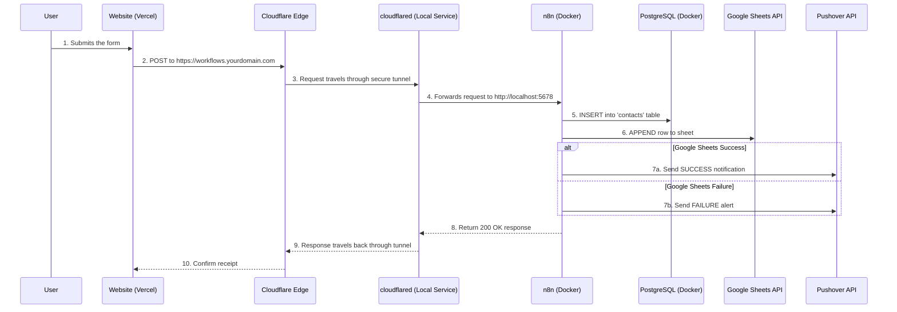
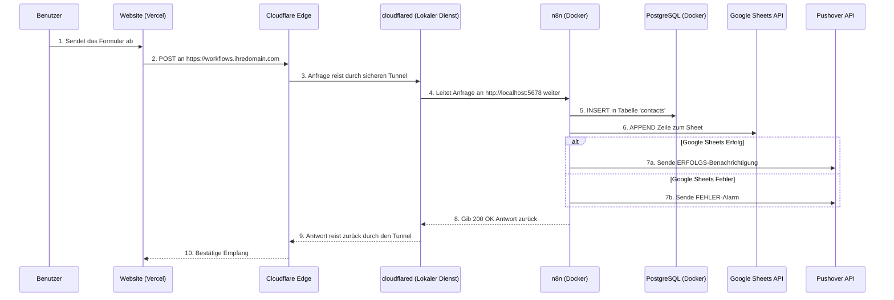
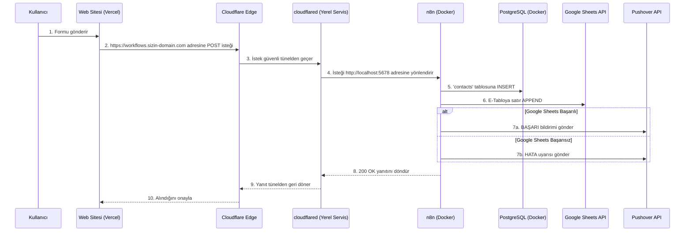

<div align="center">
  
  <h1>Self-Hosted Veri Otomasyon ve Analiz Merkezi</h1>
  <h3>Cloudflare ile Güvence Altına Alınmış, Uçtan Uca Form Veri Hattı</h3>
</div>

<p align="center">
  <a href="#-english-version">🇬🇧 English</a> • 
  <a href="#-deutsche-version">🇩🇪 Deutsch</a> • 
  <a href="#-türkçe-versiyon">🇹🇷 Türkçe</a>
</p>

<p align="center">
  Bu depo, bir web sitesindeki form gönderiminden başlayarak, verinin işlenmesi, depolanması, yedeklenmesi ve anlık bildirimlerle takibine kadar uzanan; tamamı Docker üzerinde yerel bir makinede çalışan ve Cloudflare Tüneli ile güvence altına alınmış, uçtan uca, güvenli ve sağlam bir veri otomasyonu kurmak için gereken <strong>her şeyi</strong> içeren nihai rehberdir.
</p>

---

<details id="-english-version">
<summary><h2>🇬🇧 English Version</h2></summary>

### Table of Contents
1.  [**Architectural Overview**](#-architectural-overview)
2.  [**Features**](#-features)
3.  [**Technology Stack**](#-technology-stack)
4.  [**Project Structure**](#-project-structure)
5.  [**Prerequisites Checklist**](#-prerequisites-checklist)
6.  [**Complete Setup Guide (5 Stages)**](#-complete-setup-guide-5-stages)
    *   [Stage 1: Local Project Setup](#stage-1-local-project-setup)
    *   [Stage 2: Securing with Cloudflare Tunnel](#stage-2-securing-with-cloudflare-tunnel)
    *   [Stage 3: Launching Services with Docker](#stage-3-launching-services-with-docker)
    *   [Stage 4: Post-Launch Configuration](#stage-4-post-launch-configuration)
    *   [Stage 5: Frontend & Webhook Integration](#stage-5-frontend--webhook-integration)
7.  [**System Operation & Maintenance**](#-system-operation--maintenance)
8.  [**Backup Strategy**](#-backup-strategy)
9.  [**License**](#-license)

---

### 🏗️ Architectural Overview

This diagram illustrates the complete, end-to-end data flow from the user's browser to your notification device.



### ✨ Features
- **Fully Self-Hosted & Sovereign:** Your data resides on your own machine.
- **Zero-Trust Security:** No open ports on your router. All traffic is encrypted and authenticated via Cloudflare Tunnel.
- **Cost-Effective:** Drastically reduces costs by eliminating the need for a VPS and expensive SaaS automation tools.
- **Real-time Monitoring:** Instant success and failure notifications via Pushover ensure you're always aware of the system's health.
- **Robust Data Pipeline:** A resilient n8n workflow that logs data to a relational database (PostgreSQL) and a user-friendly spreadsheet (Google Sheets).
- **Automated & Scalable:** The entire stack is containerized with Docker for easy deployment, management, and automatic restarts.

### 🛠️ Technology Stack
| Component | Role |
| :--- | :--- |
| **Docker Compose** | Orchestrates and runs all services (n8n, PostgreSQL). |
| **n8n** | The core workflow automation engine. |
| **PostgreSQL** | Primary relational database for storing all form submissions. |
| **Cloudflare Tunnel**| Securely connects your local n8n instance to the public internet. |
| **Google Sheets** | Provides a simple, spreadsheet-based view of the data for non-technical users. |
| **Pushover** | Delivers real-time push notifications for workflow status. |
| **Vercel / Netlify** | (Example) Hosting platform for the public-facing website with the form. |

### 📁 Project Structure
```
self-hosted-business-hub/
├── .env.example              # Environment variable template
├── .gitignore                # Files to be ignored by Git
├── docker-compose.yml        # Defines the Docker services (n8n, postgres)
├── n8n-workflows/
│   ├── 1_formspree_pipeline.json # The main data processing workflow
│   └── 2_weekly_backup.json    # Placeholder for backup workflow
├── sql-schema/
│   └── schema.sql            # The SQL script to create database tables
├── LICENSE                   # Project's MIT License
└── README.md                 # This file
```

### ✅ Prerequisites Checklist
Before you begin, ensure you have the following accounts and tools set up.

| Item | Status | Purpose |
| :--- | :--- | :--- |
| **Docker Desktop** | ☐ | To run the n8n and PostgreSQL containers. [Download](https://www.docker.com/products/docker-desktop/) |
| **Cloudflare Account** | ☐ | To manage your domain and create the secure tunnel. |
| **A Domain Name** | ☐ | The domain must be managed by your Cloudflare account. |
| **Google Cloud Platform Project** | ☐ | To create a Service Account for Google Sheets/Drive API access. |
| **Pushover Account** | ☐ | To receive push notifications. Get your User Key and create an API Token. |
| **Git** | ☐ | To clone this project repository. [Download](https://git-scm.com/downloads) |
| **Homebrew (macOS)** | ☐ | Recommended for easily installing the `cloudflared` CLI tool. |

---

### 🚀 Complete Setup Guide (5 Stages)
Follow these stages in order to build and launch the entire system.

<details>
<summary><h4>Stage 1: Local Project Setup</h4></summary>

1.  **Clone the Repository:**
    ```bash
    git clone [PROJECT_URL] self-hosted-business-hub
    ```
2.  **Navigate into the Project Directory:**
    ```bash
    cd self-hosted-business-hub
    ```
3.  **Create Your Environment File:**
    Copy the template to create your local configuration file. This file is ignored by Git to keep your secrets safe.
    ```bash
    cp .env.example .env
    ```
4.  **Configure Your Environment:**
    Open the newly created `.env` file in a text editor and fill in the values.
    > **❗️ Important:** Choose a strong, unique password for `POSTGRES_PASSWORD`. Set `N8N_HOST` to the subdomain you will use with Cloudflare (e.g., `workflows.yourdomain.com`).
</details>

<details>
<summary><h4>Stage 2: Securing with Cloudflare Tunnel</h4></summary>

This critical stage exposes your local n8n service to the internet securely without opening any ports.

1.  **Install `cloudflared` CLI:**
    ```bash
    brew install cloudflare/cloudflare/cloudflared
    ```
2.  **Authenticate with Cloudflare:**
    This command will open a browser window. Log in and authorize the CLI for the domain you intend to use.
    ```bash
    cloudflared tunnel login
    ```
3.  **Create a Tunnel:**
    This creates a persistent tunnel. Name it something memorable.
    ```bash
    cloudflared tunnel create n8n-tunnel
    ```
    > **ℹ️ Note:** Note the Tunnel UUID and the path to the credential file (`.json`) that this command outputs. You will need them.
4.  **Create a Configuration File:**
    Create a file at `~/.cloudflared/config.yml`. Paste the content below, replacing the placeholder values with your own.
    ```yaml
    tunnel: YOUR_TUNNEL_UUID_HERE
    credentials-file: /Users/YOUR_USERNAME/.cloudflared/YOUR_TUNNEL_UUID_HERE.json

    ingress:
      - hostname: workflows.yourdomain.com # Must match N8N_HOST in .env
        service: http://localhost:5678
      - service: http_status:404 # Catch-all to prevent exposing other services
    ```
5.  **Create a DNS Record for the Tunnel:**
    This command links your public hostname to your tunnel.
    ```bash
    cloudflared tunnel route dns n8n-tunnel workflows.yourdomain.com
    ```
6.  **Run the Tunnel as a Service:**
    This ensures the tunnel starts automatically when your computer boots up.
    ```bash
    sudo cloudflared service install
    ```
</details>

<details>
<summary><h4>Stage 3: Launching Services with Docker</h4></summary>

1.  **Start All Containers:**
    From the root of the project directory, run this command. The `-d` flag runs them in detached mode (in the background).
    ```bash
    docker-compose up -d
    ```
2.  **Verify Services are Running:**
    ```bash
    docker ps
    ```
    You should see two containers, `n8n` and `postgres-db`, with a status of `Up`.
</details>

<details>
<summary><h4>Stage 4: Post-Launch Configuration</h4></summary>

With the infrastructure running, it's time to configure the applications.

<details>
<summary><strong>4.1: Setting up the PostgreSQL Database</strong></summary>

1.  **Connect to the Database:**
    Use a database client like TablePlus, DBeaver, or PgAdmin with the following credentials:
    - **Host:** `localhost`
    - **Port:** `5432`
    - **Database:** `postgres`
    - **User:** `postgres`
    - **Password:** The `POSTGRES_PASSWORD` you set in your `.env` file.
2.  **Create the Schema:**
    Open a new SQL query tab in your client. Copy the entire content of `sql-schema/schema.sql`, paste it into the query tab, and execute it. This will create all the necessary tables.
</details>
<details>
<summary><strong>4.2: Configuring n8n and Workflows</strong></summary>

1.  **Access n8n:**
    Open your browser and navigate to `http://localhost:5678`. Set up your n8n owner account.
2.  **Create Credentials:**
    This is the most important step. In the n8n UI, go to the "Credentials" section from the left menu and click "Add credential". Create the following:
    - **PostgreSQL:** Use the following settings.
      - **Host:** `postgres` (This is the service name from `docker-compose.yml`)
      - **Database:** `postgres`
      - **User:** `postgres`
      - **Password:** The `POSTGRES_PASSWORD` from your `.env` file.
    - **Google API:** Create a credential of type "Google API". You will need to authenticate using a Service Account JSON file from your Google Cloud Platform project.
    - **Pushover:** Create a Pushover credential using your User Key and an API Token/Key you create for this application in your Pushover account.
3.  **Import the Workflow:**
    - In the "Workflows" section, click "Import" -> "Import from file...".
    - Select the `n8n-workflows/1_formspree_pipeline.json` file.
4.  **Configure the Imported Workflow:**
    Open the new workflow.
    - Click on the "Insert to PostgreSQL" node. In the "Credential" dropdown, select the PostgreSQL credential you just created.
    - Click on the "Append to Google Sheet" node. Select your Google API credential. Then, enter your Google Sheet ID and the name of the sheet.
    - Do the same for both "Pushover" nodes, selecting your Pushover credential and configuring the success/failure messages as desired.
    - Make sure the error handling path (the red dot from the Google Sheets node) is connected to the failure notification node.
5.  **Activate the Workflow:**
    Once everything is configured and saved, toggle the "Active" switch in the top-right corner to `ON`.
</details>
</details>

<details>
<summary><h4>Stage 5: Frontend & Webhook Integration</h4></summary>

1.  **Get Your Production Webhook URL:**
    In the n8n workflow, click on the "Webhook Trigger" node. Copy the "Production URL". It will look like `https://workflows.yourdomain.com/webhook/formspree-webhook`.
2.  **Update Your Website's Form:**
    In the HTML code of your website (hosted on Vercel or elsewhere), set the `action` attribute of your `<form>` tag to this production URL and ensure the method is `POST`.
    ```html
    <form action="https://workflows.yourdomain.com/webhook/formspree-webhook" method="POST">
      ... your form fields ...
    </form>
    ```
3.  **Deploy Your Website:**
    Push the changes to your frontend application. Now, every submission will be sent directly to your self-hosted n8n instance.

> 🎉 **Congratulations!** Your secure, self-hosted data pipeline is now fully operational.
</details>

### ⚙️ System Operation & Maintenance
- **To Stop the System:** Navigate to the project directory and run `docker-compose down`.
- **To Restart the System:** Run `docker-compose up -d`.
- **To Check Logs:** Use `docker-compose logs n8n` or `docker-compose logs postgres`.
- **Automatic Restarts:** Both containers and the Cloudflare Tunnel service are configured to restart automatically on system boot, ensuring high availability as long as the host machine is running.

### 💾 Backup Strategy
- **Data:** The PostgreSQL data is persisted in a Docker volume named `pgdata`. You should periodically back up this volume.
- **n8n Configuration:** The n8n workflows and credentials are in a Docker volume named `n8n_data`. This should also be backed up.
- **Workflow `2_weekly_backup.json`:** This is a placeholder. You can implement this workflow to automatically run a SQL dump command inside the `postgres` container and upload the backup file to a secure location like Google Drive or AWS S3.

### ⚖️ License
This project is licensed under the MIT License. See the [LICENSE](LICENSE) file for details.

</details>

<br>

<details id="-deutsche-version">
<summary><h2>🇩🇪 Deutsche Version</h2></summary>

### Inhaltsverzeichnis
1.  [**Architekturübersicht**](#-architekturübersicht-1)
2.  [**Funktionen**](#-funktionen-1)
3.  [**Technologie-Stack**](#-technologie-stack-1)
4.  [**Projektstruktur**](#-projektstruktur-1)
5.  [**Checkliste der Voraussetzungen**](#-checkliste-der-voraussetzungen-1)
6.  [**Vollständige Einrichtungsanleitung (5 Stufen)**](#-vollständige-einrichtungsanleitung-5-stufen-1)
    *   [Stufe 1: Lokales Projekt-Setup](#stufe-1-lokales-projekt-setup-1)
    *   [Stufe 2: Absicherung mit Cloudflare Tunnel](#stufe-2-absicherung-mit-cloudflare-tunnel-1)
    *   [Stufe 3: Starten der Dienste mit Docker](#stufe-3-starten-der-dienste-mit-docker-1)
    *   [Stufe 4: Konfiguration nach dem Start](#stufe-4-konfiguration-nach-dem-start-1)
    *   [Stufe 5: Frontend- & Webhook-Integration](#stufe-5-frontend--webhook-integration-1)
7.  [**Systembetrieb & Wartung**](#-systembetrieb--wartung-1)
8.  [**Backup-Strategie**](#-backup-strategie-1)
9.  [**Lizenz**](#-lizenz-1)

---

### 🏗️ Architekturübersicht

Dieses Diagramm veranschaulicht den vollständigen End-to-End-Datenfluss vom Browser des Benutzers bis zu Ihrem Benachrichtigungsgerät.



### ✨ Funktionen
- **Vollständig Self-Hosted & Souverän:** Ihre Daten verbleiben auf Ihrer eigenen Maschine.
- **Zero-Trust-Sicherheit:** Keine offenen Ports an Ihrem Router. Der gesamte Verkehr wird über den Cloudflare Tunnel verschlüsselt und authentifiziert.
- **Kosteneffizient:** Reduziert die Kosten drastisch, da kein VPS und keine teuren SaaS-Automatisierungstools benötigt werden.
- **Echtzeitüberwachung:** Sofortige Erfolgs- und Fehlermeldungen über Pushover stellen sicher, dass Sie immer über den Zustand des Systems informiert sind.
- **Robuste Datenpipeline:** Ein widerstandsfähiger n8n-Workflow, der Daten in einer relationalen Datenbank (PostgreSQL) und einer benutzerfreundlichen Tabelle (Google Sheets) protokolliert.
- **Automatisiert & Skalierbar:** Der gesamte Stack ist mit Docker containerisiert für einfache Bereitstellung, Verwaltung und automatische Neustarts.

### 🛠️ Technologie-Stack
| Komponente | Rolle |
| :--- | :--- |
| **Docker Compose** | Orchestriert und betreibt alle Dienste (n8n, PostgreSQL). |
| **n8n** | Die zentrale Workflow-Automatisierungs-Engine. |
| **PostgreSQL** | Primäre relationale Datenbank zur Speicherung aller Formularübermittlungen. |
| **Cloudflare Tunnel**| Verbindet Ihre lokale n8n-Instanz sicher mit dem öffentlichen Internet. |
| **Google Sheets** | Bietet eine einfache, tabellenbasierte Ansicht der Daten für nicht-technische Benutzer. |
| **Pushover** | Liefert Echtzeit-Push-Benachrichtigungen über den Workflow-Status. |
| **Vercel / Netlify** | (Beispiel) Hosting-Plattform für die öffentliche Website mit dem Formular. |

### 📁 Projektstruktur
```
self-hosted-business-hub/
├── .env.example              # Vorlage für Umgebungsvariablen
├── .gitignore                # Dateien, die von Git ignoriert werden sollen
├── docker-compose.yml        # Definiert die Docker-Dienste (n8n, postgres)
├── n8n-workflows/
│   ├── 1_formspree_pipeline.json # Der Haupt-Workflow zur Datenverarbeitung
│   └── 2_weekly_backup.json    # Platzhalter für Backup-Workflow
├── sql-schema/
│   └── schema.sql            # Das SQL-Skript zum Erstellen der Datenbanktabellen
├── LICENSE                   # MIT-Lizenz des Projekts
└── README.md                 # Diese Datei
```

### ✅ Checkliste der Voraussetzungen
Bevor Sie beginnen, stellen Sie sicher, dass Sie die folgenden Konten und Tools eingerichtet haben.

| Element | Status | Zweck |
| :--- | :--- | :--- |
| **Docker Desktop** | ☐ | Zum Ausführen der n8n- und PostgreSQL-Container. [Herunterladen](https://www.docker.com/products/docker-desktop/) |
| **Cloudflare-Konto** | ☐ | Zur Verwaltung Ihrer Domain und zur Erstellung des sicheren Tunnels. |
| **Ein Domain-Name** | ☐ | Die Domain muss von Ihrem Cloudflare-Konto verwaltet werden. |
| **Google Cloud Platform Projekt**| ☐ | Zum Erstellen eines Dienstkontos für den Google Sheets/Drive API-Zugriff. |
| **Pushover-Konto** | ☐ | Zum Empfangen von Push-Benachrichtigungen. Holen Sie sich Ihren User Key und erstellen Sie ein API-Token. |
| **Git** | ☐ | Zum Klonen dieses Projekt-Repositorys. [Herunterladen](https://git-scm.com/downloads) |
| **Homebrew (macOS)** | ☐ | Empfohlen für die einfache Installation des `cloudflared` CLI-Tools. |

---

### 🚀 Vollständige Einrichtungsanleitung (5 Stufen)
Befolgen Sie diese Stufen in der angegebenen Reihenfolge, um das gesamte System zu erstellen und zu starten.

<details>
<summary><h4>Stufe 1: Lokales Projekt-Setup</h4></summary>

1.  **Repository klonen:**
    ```bash
    git clone [PROJEKT_URL] self-hosted-business-hub
    ```
2.  **In das Projektverzeichnis wechseln:**
    ```bash
    cd self-hosted-business-hub
    ```
3.  **Ihre Umgebungsdatei erstellen:**
    Kopieren Sie die Vorlage, um Ihre lokale Konfigurationsdatei zu erstellen. Diese Datei wird von Git ignoriert, um Ihre Geheimnisse sicher zu halten.
    ```bash
    cp .env.example .env
    ```
4.  **Ihre Umgebung konfigurieren:**
    Öffnen Sie die neu erstellte `.env`-Datei in einem Texteditor und füllen Sie die Werte aus.
    > **❗️ Wichtig:** Wählen Sie ein starkes, eindeutiges Passwort für `POSTGRES_PASSWORD`. Setzen Sie `N8N_HOST` auf die Subdomain, die Sie mit Cloudflare verwenden werden (z. B. `workflows.ihredomain.com`).
</details>

<details>
<summary><h4>Stufe 2: Absicherung mit Cloudflare Tunnel</h4></summary>

Diese kritische Stufe macht Ihren lokalen n8n-Dienst sicher im Internet verfügbar, ohne Ports zu öffnen.

1.  **`cloudflared` CLI installieren:**
    ```bash
    brew install cloudflare/cloudflare/cloudflared
    ```
2.  **Bei Cloudflare authentifizieren:**
    Dieser Befehl öffnet ein Browserfenster. Melden Sie sich an und autorisieren Sie die CLI für die Domain, die Sie verwenden möchten.
    ```bash
    cloudflared tunnel login
    ```
3.  **Einen Tunnel erstellen:**
    Dies erstellt einen dauerhaften Tunnel. Geben Sie ihm einen einprägsamen Namen.
    ```bash
    cloudflared tunnel create n8n-tunnel
    ```
    > **ℹ️ Hinweis:** Notieren Sie sich die Tunnel-UUID und den Pfad zur Anmeldeinformationsdatei (`.json`), die dieser Befehl ausgibt. Sie werden sie benötigen.
4.  **Eine Konfigurationsdatei erstellen:**
    Erstellen Sie eine Datei unter `~/.cloudflared/config.yml`. Fügen Sie den folgenden Inhalt ein und ersetzen Sie die Platzhalterwerte durch Ihre eigenen.
    ```yaml
    tunnel: IHRE_TUNNEL_UUID_HIER
    credentials-file: /Users/IHR_BENUTZERNAME/.cloudflared/IHRE_TUNNEL_UUID_HIER.json

    ingress:
      - hostname: workflows.ihredomain.com # Muss mit N8N_HOST in .env übereinstimmen
        service: http://localhost:5678
      - service: http_status:404 # Catch-all, um die Preisgabe anderer Dienste zu verhindern
    ```
5.  **Einen DNS-Eintrag für den Tunnel erstellen:**
    Dieser Befehl verknüpft Ihren öffentlichen Hostnamen mit Ihrem Tunnel.
    ```bash
    cloudflared tunnel route dns n8n-tunnel workflows.ihredomain.com
    ```
6.  **Den Tunnel als Dienst ausführen:**
    Dies stellt sicher, dass der Tunnel beim Starten Ihres Computers automatisch gestartet wird.
    ```bash
    sudo cloudflared service install
    ```
</details>

<details>
<summary><h4>Stufe 3: Starten der Dienste mit Docker</h4></summary>

1.  **Alle Container starten:**
    Führen Sie diesen Befehl vom Stammverzeichnis des Projekts aus. Das `-d`-Flag führt sie im getrennten Modus (im Hintergrund) aus.
    ```bash
    docker-compose up -d
    ```
2.  **Überprüfen, ob die Dienste laufen:**
    ```bash
    docker ps
    ```
    Sie sollten zwei Container sehen, `n8n` und `postgres-db`, mit dem Status `Up`.
</details>

<details>
<summary><h4>Stufe 4: Konfiguration nach dem Start</h4></summary>

Nachdem die Infrastruktur läuft, ist es Zeit, die Anwendungen zu konfigurieren.

<details>
<summary><strong>4.1: Einrichten der PostgreSQL-Datenbank</strong></summary>

1.  **Mit der Datenbank verbinden:**
    Verwenden Sie einen Datenbank-Client wie TablePlus, DBeaver oder PgAdmin mit den folgenden Anmeldeinformationen:
    - **Host:** `localhost`
    - **Port:** `5432`
    - **Datenbank:** `postgres`
    - **Benutzer:** `postgres`
    - **Passwort:** Das `POSTGRES_PASSWORD`, das Sie in Ihrer `.env`-Datei festgelegt haben.
2.  **Das Schema erstellen:**
    Öffnen Sie einen neuen SQL-Abfrage-Tab in Ihrem Client. Kopieren Sie den gesamten Inhalt von `sql-schema/schema.sql`, fügen Sie ihn in den Abfrage-Tab ein und führen Sie ihn aus. Dadurch werden alle notwendigen Tabellen erstellt.
</details>
<details>
<summary><strong>4.2: Konfigurieren von n8n und Workflows</strong></summary>

1.  **Auf n8n zugreifen:**
    Öffnen Sie Ihren Browser und navigieren Sie zu `http://localhost:5678`. Richten Sie Ihr n8n-Besitzerkonto ein.
2.  **Anmeldeinformationen erstellen:**
    Dies ist der wichtigste Schritt. Gehen Sie in der n8n-Benutzeroberfläche im linken Menü zum Abschnitt "Credentials" und klicken Sie auf "Add credential". Erstellen Sie Folgendes:
    - **PostgreSQL:** Verwenden Sie die folgenden Einstellungen.
      - **Host:** `postgres` (Dies ist der Dienstname aus `docker-compose.yml`)
      - **Datenbank:** `postgres`
      - **Benutzer:** `postgres`
      - **Passwort:** Das `POSTGRES_PASSWORD` aus Ihrer `.env`-Datei.
    - **Google API:** Erstellen Sie eine Anmeldeinformation vom Typ "Google API". Sie müssen sich mit einer Service Account JSON-Datei aus Ihrem Google Cloud Platform-Projekt authentifizieren.
    - **Pushover:** Erstellen Sie eine Pushover-Anmeldeinformation mit Ihrem User Key und einem API-Token/Key, den Sie für diese Anwendung in Ihrem Pushover-Konto erstellen.
3.  **Den Workflow importieren:**
    - Klicken Sie im Abschnitt "Workflows" auf "Import" -> "Import from file...".
    - Wählen Sie die Datei `n8n-workflows/1_formspree_pipeline.json`.
4.  **Den importierten Workflow konfigurieren:**
    Öffnen Sie den neuen Workflow.
    - Klicken Sie auf den Knoten "Insert to PostgreSQL". Wählen Sie im Dropdown-Menü "Credential" die gerade erstellte PostgreSQL-Anmeldeinformation aus.
    - Klicken Sie auf den Knoten "Append to Google Sheet". Wählen Sie Ihre Google-API-Anmeldeinformation aus. Geben Sie dann Ihre Google Sheet ID und den Namen des Blattes ein.
    - Machen Sie dasselbe für beide "Pushover"-Knoten, wählen Sie Ihre Pushover-Anmeldeinformation aus und konfigurieren Sie die Erfolgs-/Fehlermeldungen wie gewünscht.
    - Stellen Sie sicher, dass der Fehlerbehandlungspfad (der rote Punkt vom Google-Sheets-Knoten) mit dem Knoten für die Fehlermeldung verbunden ist.
5.  **Den Workflow aktivieren:**
    Sobald alles konfiguriert und gespeichert ist, schalten Sie den Schalter "Active" in der oberen rechten Ecke auf `ON`.
</details>
</details>

<details>
<summary><h4>Stufe 5: Frontend- & Webhook-Integration</h4></summary>

1.  **Ihre Produktions-Webhook-URL abrufen:**
    Klicken Sie im n8n-Workflow auf den Knoten "Webhook Trigger". Kopieren Sie die "Production URL". Sie wird wie `https://workflows.ihredomain.com/webhook/formspree-webhook` aussehen.
2.  **Das Formular Ihrer Website aktualisieren:**
    Setzen Sie im HTML-Code Ihrer Website (gehostet auf Vercel oder anderswo) das `action`-Attribut Ihres `<form>`-Tags auf diese Produktions-URL und stellen Sie sicher, dass die Methode `POST` ist.
    ```html
    <form action="https://workflows.ihredomain.com/webhook/formspree-webhook" method="POST">
      ... Ihre Formularfelder ...
    </form>
    ```
3.  **Ihre Website bereitstellen:**
    Pushen Sie die Änderungen zu Ihrer Frontend-Anwendung. Jetzt wird jede Übermittlung direkt an Ihre selbst gehostete n8n-Instanz gesendet.

> 🎉 **Herzlichen Glückwunsch!** Ihre sichere, selbst gehostete Datenpipeline ist jetzt voll funktionsfähig.
</details>

### ⚙️ Systembetrieb & Wartung
- **Um das System zu stoppen:** Navigieren Sie zum Projektverzeichnis und führen Sie `docker-compose down` aus.
- **Um das System neu zu starten:** Führen Sie `docker-compose up -d` aus.
- **Um Protokolle zu überprüfen:** Verwenden Sie `docker-compose logs n8n` oder `docker-compose logs postgres`.
- **Automatische Neustarts:** Sowohl die Container als auch der Cloudflare-Tunnel-Dienst sind so konfiguriert, dass sie beim Systemstart automatisch neu starten, um eine hohe Verfügbarkeit zu gewährleisten, solange die Host-Maschine läuft.

### 💾 Backup-Strategie
- **Daten:** Die PostgreSQL-Daten werden in einem Docker-Volume namens `pgdata` gespeichert. Sie sollten dieses Volume regelmäßig sichern.
- **n8n-Konfiguration:** Die n8n-Workflows und Anmeldeinformationen befinden sich in einem Docker-Volume namens `n8n_data`. Dieses sollte ebenfalls gesichert werden.
- **Workflow `2_weekly_backup.json`:** Dies ist ein Platzhalter. Sie können diesen Workflow implementieren, um automatisch einen SQL-Dump-Befehl im `postgres`-Container auszuführen und die Sicherungsdatei an einen sicheren Ort wie Google Drive oder AWS S3 hochzuladen.

### ⚖️ Lizenz
Dieses Projekt ist unter der MIT-Lizenz lizenziert. Siehe die Datei [LICENSE](LICENSE) für Details.

</details>

<br>

<details id="-türkçe-versiyon">
<summary><h2>🇹🇷 Türkçe Versiyon</h2></summary>

### İçindekiler
1.  [**Mimariye Genel Bakış**](#-mimariye-genel-bakış-1)
2.  [**Özellikler**](#-özellikler-1)
3.  [**Teknoloji Yığını**](#-teknoloji-yığını-1)
4.  [**Proje Yapısı**](#-proje-yapısı-1)
5.  [**Ön Gereksinimler Kontrol Listesi**](#-ön-gereksinimler-kontrol-listesi-1)
6.  [**Eksiksiz Kurulum Rehberi (5 Aşama)**](#-eksiksiz-kurulum-rehberi-5-aşama-1)
    *   [Aşama 1: Yerel Proje Kurulumu](#aşama-1-yerel-proje-kurulumu-1)
    *   [Aşama 2: Cloudflare Tüneli ile Güvenliği Sağlama](#aşama-2-cloudflare-tüneli-ile-güvenliği-sağlama-1)
    *   [Aşama 3: Servisleri Docker ile Başlatma](#aşama-3-servisleri-docker-ile-başlatma-1)
    *   [Aşama 4: Başlatma Sonrası Yapılandırma](#aşama-4-başlatma-sonrası-yapılandırma-1)
    *   [Aşama 5: Frontend & Webhook Entegrasyonu](#aşama-5-frontend--webhook-entegrasyonu-1)
7.  [**Sistem Operasyonu ve Bakımı**](#-sistem-operasyonu-ve-bakımı-1)
8.  [**Yedekleme Stratejisi**](#-yedekleme-stratejisi-1)
9.  [**Lisans**](#-lisans-1)

---

### 🏗️ Mimariye Genel Bakış

Bu diyagram, kullanıcının tarayıcısından sizin bildirim cihazınıza kadar olan eksiksiz, uçtan uca veri akışını göstermektedir.



### ✨ Özellikler
- **Tamamen Self-Hosted & Veri Egemenliği:** Verileriniz kendi makinenizde bulunur.
- **Sıfır Güven (Zero-Trust) Güvenliği:** Yönlendiricinizde açık port yok. Tüm trafik şifrelenir ve Cloudflare Tüneli aracılığıyla doğrulanır.
- **Düşük Maliyetli:** VPS ve pahalı SaaS otomasyon araçlarına olan ihtiyacı ortadan kaldırarak maliyetleri önemli ölçüde azaltır.
- **Gerçek Zamanlı Takip:** Pushover aracılığıyla anlık başarı ve hata bildirimleri, sistemin sağlığından her zaman haberdar olmanızı sağlar.
- **Sağlam Veri Hattı:** Verileri ilişkisel bir veritabanına (PostgreSQL) ve kullanıcı dostu bir e-tabloya (Google Sheets) kaydeden dayanıklı bir n8n iş akışı.
- **Otomatik & Ölçeklenebilir:** Tüm altyapı, kolay dağıtım, yönetim ve otomatik yeniden başlatmalar için Docker ile konteynerize edilmiştir.

### 🛠️ Teknoloji Yığını
| Bileşen | Görevi |
| :--- | :--- |
| **Docker Compose** | Tüm servisleri (n8n, PostgreSQL) yönetir ve çalıştırır. |
| **n8n** | Çekirdek iş akışı otomasyon motoru. |
| **PostgreSQL** | Tüm form gönderimlerini saklamak için kullanılan birincil ilişkisel veritabanı. |
| **Cloudflare Tunnel**| Yerel n8n örneğinizi herkese açık internete güvenli bir şekilde bağlar. |
| **Google Sheets** | Teknik olmayan kullanıcılar için verilerin basit, e-tablo tabanlı bir görünümünü sunar. |
| **Pushover** | İş akışı durumu için gerçek zamanlı anlık bildirimler gönderir. |
| **Vercel / Netlify** | (Örnek) Formu içeren, halka açık web sitesi için barındırma platformu. |

### 📁 Proje Yapısı
```
self-hosted-business-hub/
├── .env.example              # Ortam değişkenleri şablonu
├── .gitignore                # Git tarafından yok sayılacak dosyalar
├── docker-compose.yml        # Docker servislerini tanımlar (n8n, postgres)
├── n8n-workflows/
│   ├── 1_formspree_pipeline.json # Ana veri işleme iş akışı
│   └── 2_weekly_backup.json    # Yedekleme iş akışı için yer tutucu
├── sql-schema/
│   └── schema.sql            # Veritabanı tablolarını oluşturmak için SQL betiği
├── LICENSE                   # Projenin MIT Lisansı
└── README.md                 # Bu dosya
```

### ✅ Ön Gereksinimler Kontrol Listesi
Başlamadan önce, aşağıdaki hesaplara ve araçlara sahip olduğunuzdan emin olun.

| Öğe | Durum | Amaç |
| :--- | :--- | :--- |
| **Docker Desktop** | ☐ | n8n ve PostgreSQL konteynerlerini çalıştırmak için. [İndir](https://www.docker.com/products/docker-desktop/) |
| **Cloudflare Hesabı** | ☐ | Alan adınızı yönetmek ve güvenli tüneli oluşturmak için. |
| **Bir Alan Adı** | ☐ | Alan adı Cloudflare hesabınız tarafından yönetilmelidir. |
| **Google Cloud Platform Projesi**| ☐ | Google Sheets/Drive API erişimi için bir Servis Hesabı oluşturmak. |
| **Pushover Hesabı** | ☐ | Anlık bildirimler almak için. User Key'inizi alın ve bir API Token oluşturun. |
| **Git** | ☐ | Bu proje deposunu klonlamak için. [İndir](https://git-scm.com/downloads) |
| **Homebrew (macOS)** | ☐ | `cloudflared` CLI aracını kolayca kurmak için önerilir. |

---

### 🚀 Eksiksiz Kurulum Rehberi (5 Aşama)
Tüm sistemi kurmak ve başlatmak için bu aşamaları sırayla takip edin.

<details>
<summary><h4>Aşama 1: Yerel Proje Kurulumu</h4></summary>

1.  **Depoyu Klonlayın:**
    ```bash
    git clone [PROJE_URL] self-hosted-business-hub
    ```
2.  **Proje Dizinine Girin:**
    ```bash
    cd self-hosted-business-hub
    ```
3.  **Ortam Dosyanızı Oluşturun:**
    Şablonu kopyalayarak yerel yapılandırma dosyanızı oluşturun. Bu dosya, sırlarınızı güvende tutmak için Git tarafından yok sayılır.
    ```bash
    cp .env.example .env
    ```
4.  **Ortamınızı Yapılandırın:**
    Yeni oluşturulan `.env` dosyasını bir metin düzenleyicide açın ve değerleri doldurun.
    > **❗️ Önemli:** `POSTGRES_PASSWORD` için güçlü ve benzersiz bir şifre seçin. `N8N_HOST`'u Cloudflare'de kullanacağınız alt alan adınıza ayarlayın (ör: `workflows.sizin-domain.com`).
</details>

<details>
<summary><h4>Aşama 2: Cloudflare Tüneli ile Güvenliği Sağlama</h4></summary>

Bu kritik aşama, yerel n8n servisinizi herhangi bir port açmadan internete güvenli bir şekilde açar.

1.  **`cloudflared` CLI'yi Kurun:**
    ```bash
    brew install cloudflare/cloudflare/cloudflared
    ```
2.  **Cloudflare ile Oturum Açın:**
    Bu komut bir tarayıcı penceresi açacaktır. Giriş yapın ve kullanmayı düşündüğünüz alan adı için CLI'yi yetkilendirin.
    ```bash
    cloudflared tunnel login
    ```
3.  **Bir Tünel Oluşturun:**
    Bu, kalıcı bir tünel oluşturur. Hatırlayacağınız bir isim verin.
    ```bash
    cloudflared tunnel create n8n-tunnel
    ```
    > **ℹ️ Not:** Bu komutun çıktısı olan Tünel UUID'sini ve kimlik bilgisi dosyasının (`.json`) yolunu not alın. İhtiyacınız olacak.
4.  **Bir Yapılandırma Dosyası Oluşturun:**
    `~/.cloudflared/config.yml` konumunda bir dosya oluşturun. Aşağıdaki içeriği yapıştırın ve yer tutucu değerleri kendinize göre değiştirin.
    ```yaml
    tunnel: SIZIN_TUNEL_UUID_BURAYA
    credentials-file: /Users/KULLANICI_ADINIZ/.cloudflared/SIZIN_TUNEL_UUID_BURAYA.json

    ingress:
      - hostname: workflows.sizin-domain.com # .env dosyasındaki N8N_HOST ile eşleşmeli
        service: http://localhost:5678
      - service: http_status:404 # Diğer servislerin açığa çıkmasını önlemek için genel karşılama
    ```
5.  **Tünel için bir DNS Kaydı Oluşturun:**
    Bu komut, genel alan adınızı tünelinize bağlar.
    ```bash
    cloudflared tunnel route dns n8n-tunnel workflows.sizin-domain.com
    ```
6.  **Tüneli bir Servis Olarak Çalıştırın:**
    Bu, tünelin bilgisayarınız her açıldığında otomatik olarak başlamasını sağlar.
    ```bash
    sudo cloudflared service install
    ```
</details>

<details>
<summary><h4>Aşama 3: Servisleri Docker ile Başlatma</h4></summary>

1.  **Tüm Konteynerleri Başlatın:**
    Proje kök dizinindeyken bu komutu çalıştırın. `-d` bayrağı, onları arka planda (ayrık modda) çalıştırır.
    ```bash
    docker-compose up -d
    ```
2.  **Servislerin Çalıştığını Doğrulayın:**
    ```bash
    docker ps
    ```
    `Up` durumunda olan `n8n` ve `postgres-db` adında iki konteyner görmelisiniz.
</details>

<details>
<summary><h4>Aşama 4: Başlatma Sonrası Yapılandırma</h4></summary>

Altyapı çalışır durumdayken, uygulamaları yapılandırma zamanı geldi.

<details>
<summary><strong>4.1: PostgreSQL Veritabanını Kurma</strong></summary>

1.  **Veritabanına Bağlanın:**
    TablePlus, DBeaver veya PgAdmin gibi bir veritabanı istemcisi kullanarak aşağıdaki kimlik bilgileriyle bağlanın:
    - **Host:** `localhost`
    - **Port:** `5432`
    - **Veritabanı:** `postgres`
    - **Kullanıcı:** `postgres`
    - **Şifre:** `.env` dosyanızda belirlediğiniz `POSTGRES_PASSWORD`.
2.  **Şemayı Oluşturun:**
    İstemcinizde yeni bir SQL sorgu sekmesi açın. `sql-schema/schema.sql` dosyasının tüm içeriğini kopyalayın, sorgu sekmesine yapıştırın ve çalıştırın. Bu, gerekli tüm tabloları oluşturacaktır.
</details>
<details>
<summary><strong>4.2: n8n ve İş Akışlarını Yapılandırma</strong></summary>

1.  **n8n'e Erişin:**
    Tarayıcınızı açın ve `http://localhost:5678` adresine gidin. n8n sahip hesabınızı oluşturun.
2.  **Kimlik Bilgilerini (Credentials) Oluşturun:**
    Bu en önemli adımdır. n8n arayüzünde, sol menüden "Credentials" bölümüne gidin ve "Add credential"a tıklayın. Aşağıdakileri oluşturun:
    - **PostgreSQL:** Aşağıdaki ayarları kullanın.
      - **Host:** `postgres` (`docker-compose.yml` dosyasındaki servis adıdır)
      - **Veritabanı:** `postgres`
      - **Kullanıcı:** `postgres`
      - **Şifre:** `.env` dosyanızdaki `POSTGRES_PASSWORD`.
    - **Google API:** "Google API" türünde bir kimlik bilgisi oluşturun. Google Cloud Platform projenizden aldığınız bir Servis Hesabı JSON dosyasıyla kimlik doğrulaması yapmanız gerekecektir.
    - **Pushover:** Pushover hesabınızdaki User Key ve bu uygulama için oluşturduğunuz bir API Token/Key kullanarak bir Pushover kimlik bilgisi oluşturun.
3.  **İş Akışını İçe Aktarın:**
    - "Workflows" bölümünde, "Import" -> "Import from file..." seçeneğine tıklayın.
    - `n8n-workflows/1_formspree_pipeline.json` dosyasını seçin.
4.  **İçe Aktarılan İş Akışını Yapılandırın:**
    Yeni iş akışını açın.
    - "Insert to PostgreSQL" düğümüne tıklayın. "Credential" açılır menüsünden az önce oluşturduğunuz PostgreSQL kimlik bilgisini seçin.
    - "Append to Google Sheet" düğümüne tıklayın. Google API kimlik bilginizi seçin. Ardından, Google Sheet ID'nizi ve sayfanın adını girin.
    - Her iki "Pushover" düğümü için de aynısını yapın, Pushover kimlik bilginizi seçin ve başarı/hata mesajlarını istediğiniz gibi yapılandırın.
    - Hata yönetimi yolunun (Google Sheets düğümünden çıkan kırmızı nokta) hata bildirimi düğümüne bağlı olduğundan emin olun.
5.  **İş Akışını Etkinleştirin:**
    Her şey yapılandırılıp kaydedildikten sonra, sağ üst köşedeki "Active" anahtarını `ON` konumuna getirin.
</details>
</details>

<details>
<summary><h4>Aşama 5: Frontend & Webhook Entegrasyonu</h4></summary>

1.  **Üretim Webhook URL'nizi Alın:**
    n8n iş akışında, "Webhook Trigger" düğümüne tıklayın. "Production URL"yi kopyalayın. `https://workflows.sizin-domain.com/webhook/formspree-webhook` gibi görünecektir.
2.  **Web Sitenizin Formunu Güncelleyin:**
    Web sitenizin (Vercel veya başka bir yerde barındırılan) HTML kodunda, `<form>` etiketinizin `action` özelliğini bu üretim URL'sine ayarlayın ve metodun `POST` olduğundan emin olun.
    ```html
    <form action="https://workflows.sizin-domain.com/webhook/formspree-webhook" method="POST">
      ... form alanlarınız ...
    </form>
    ```
3.  **Web Sitenizi Dağıtın (Deploy):**
    Değişiklikleri frontend uygulamanıza push'layın. Artık her gönderim doğrudan kendi barındırdığınız n8n örneğinize gönderilecektir.

> 🎉 **Tebrikler!** Güvenli, self-hosted veri hattınız artık tamamen çalışır durumda.
</details>

### ⚙️ Sistem Operasyonu ve Bakımı
- **Sistemi Durdurmak İçin:** Proje dizinine gidin ve `docker-compose down` komutunu çalıştırın.
- **Sistemi Yeniden Başlatmak İçin:** `docker-compose up -d` komutunu çalıştırın.
- **Logları Kontrol Etmek İçin:** `docker-compose logs n8n` veya `docker-compose logs postgres` kullanın.
- **Otomatik Yeniden Başlatmalar:** Hem konteynerler hem de Cloudflare Tüneli servisi, sistem açılışında otomatik olarak yeniden başlayacak şekilde yapılandırılmıştır, bu da ana makine çalıştığı sürece yüksek kullanılabilirlik sağlar.

### 💾 Yedekleme Stratejisi
- **Veri:** PostgreSQL verileri, `pgdata` adlı bir Docker volume'ünde kalıcı olarak saklanır. Bu volume'ü periyodik olarak yedeklemelisiniz.
- **n8n Yapılandırması:** n8n iş akışları ve kimlik bilgileri, `n8n_data` adlı bir Docker volume'ündedir. Bu da yedeklenmelidir.
- **İş Akışı `2_weekly_backup.json`:** Bu bir yer tutucudur. Bu iş akışını, `postgres` konteyneri içinde otomatik olarak bir SQL dump komutu çalıştıracak ve yedekleme dosyasını Google Drive veya AWS S3 gibi güvenli bir konuma yükleyecek şekilde uygulayabilirsiniz.

### ⚖️ Lisans
Bu proje MIT Lisansı altında lisanslanmıştır. Ayrıntılar için [LICENSE](LICENSE) dosyasına bakın.

</details>
