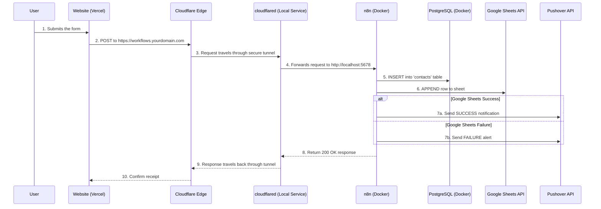
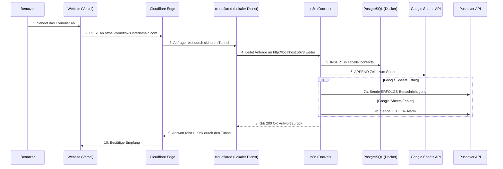
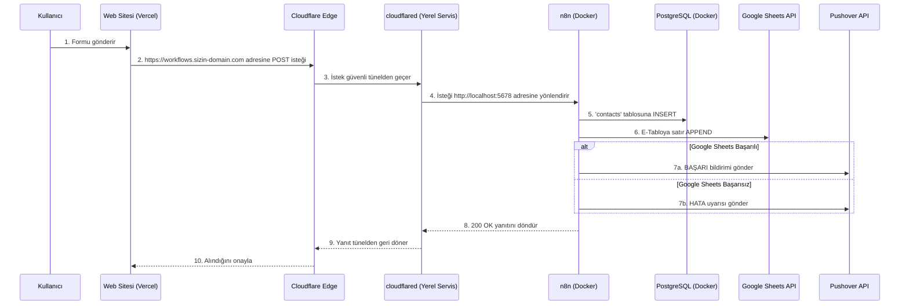

<!-- README Styling and Interactivity -->
<style>
    body { font-family: -apple-system, BlinkMacSystemFont, "Segoe UI", Helvetica, Arial, sans-serif, "Apple Color Emoji", "Segoe UI Emoji"; line-height: 1.6; }
    .container { max-width: 980px; margin: 0 auto; padding: 20px; }
    .lang-switcher { text-align: center; margin-bottom: 2rem; font-size: 1.1rem; }
    .lang-switcher a { margin: 0 10px; text-decoration: none; font-weight: 500; }
    h1, h2, h3 { border-bottom: 1px solid #dfe2e5; padding-bottom: 0.5em; }
    h1 { font-size: 2.5em; } h2 { font-size: 2em; } h3 { font-size: 1.5em; }
    details { border: 1px solid #d1d5da; border-radius: 8px; margin-bottom: 1rem; overflow: hidden; }
    summary { padding: 1rem; font-weight: bold; cursor: pointer; background-color: #f6f8fa; list-style: none; }
    summary::-webkit-details-marker { display: none; }
    summary:before { content: '▶'; margin-right: 0.5rem; }
    details[open] > summary:before { content: '▼'; }
    .details-content { padding: 1rem; border-top: 1px solid #d1d5da; }
    .code-block { position: relative; background-color: #2d2d2d; color: #f1f1f1; border-radius: 8px; margin: 1rem 0; font-family: "SF Mono", "Consolas", "Liberation Mono", Menlo, Courier, monospace; }
    .code-block-header { background-color: #3a3a3a; padding: 8px 15px; border-top-left-radius: 8px; border-top-right-radius: 8px; font-size: 0.9em; }
    .code-block pre { margin: 0; padding: 15px; overflow-x: auto; }
    .copy-btn { position: absolute; top: 5px; right: 10px; background-color: #4a4a4a; color: #fff; border: none; padding: 5px 10px; border-radius: 5px; cursor: pointer; font-size: 0.8em; opacity: 0.7; transition: opacity 0.2s; }
    .code-block:hover .copy-btn { opacity: 1; }
    .copy-btn:hover { background-color: #5a5a5a; }
    .info-box { padding: 1rem; margin: 1rem 0; border-left: 5px solid #0969da; background-color: #f0f6fc; }
    .warning-box { padding: 1rem; margin: 1rem 0; border-left: 5px solid #d73a49; background-color: #fdf2f3; }
    table { border-collapse: collapse; width: 100%; margin: 1rem 0; }
    th, td { border: 1px solid #dfe2e5; padding: 10px; text-align: left; }
    th { background-color: #f6f8fa; }
</style>

<div class="container">

<div align="center">
  
  <h1>Self-Hosted Veri Otomasyon ve Analiz Merkezi</h1>
  <h3>Cloudflare ile Güvence Altına Alınmış, Uçtan Uca Form Veri Hattı</h3>
</div>

<div class="lang-switcher">
  <a href="#-english">🇬🇧 English</a> • 
  <a href="#-deutsch">🇩🇪 Deutsch</a> • 
  <a href="#-türkçe">🇹🇷 Türkçe</a>
</div>

<p align="center">
  Bu depo, bir web sitesindeki form gönderiminden başlayarak, verinin işlenmesi, depolanması, yedeklenmesi ve anlık bildirimlerle takibine kadar uzanan; tamamı Docker üzerinde yerel bir makinede çalışan ve Cloudflare Tüneli ile güvence altına alınmış, uçtan uca, güvenli ve sağlam bir veri otomasyonu kurmak için gereken <strong>her şeyi</strong> içeren nihai rehberdir.
</p>

---

<details id="-english">
<summary><h2>🇬🇧 English Version</h2></summary>
<div class="details-content">

## Table of Contents
1.  [**Architectural Overview**](#-architectural-overview)
2.  [**Features**](#-features)
3.  [**Technology Stack**](#-technology-stack)
4.  [**Project Structure**](#-project-structure)
5.  [**Prerequisites Checklist**](#-prerequisites-checklist)
6.  [**Complete Setup Guide (5 Stages)**](#-complete-setup-guide-5-stages)
    *   [Stage 1: Local Project Setup](#stage-1-local-project-setup)
    *   [Stage 2: Securing with Cloudflare Tunnel](#stage-2-securing-with-cloudflare-tunnel)
    *   [Stage 3: Launching Services with Docker](#stage-3-launching-services-with-docker)
    *   [Stage 4: Post-Launch Configuration](#stage-4-post-launch-configuration)
    *   [Stage 5: Frontend & Webhook Integration](#stage-5-frontend--webhook-integration)
7.  [**System Operation & Maintenance**](#-system-operation--maintenance)
8.  [**Backup Strategy**](#-backup-strategy)
9.  [**License**](#-license)

---

### 🏗️ Architectural Overview

This diagram illustrates the complete, end-to-end data flow from the user's browser to your notification device.



### ✨ Features
- **Fully Self-Hosted & Sovereign:** Your data resides on your own machine.
- **Zero-Trust Security:** No open ports on your router. All traffic is encrypted and authenticated via Cloudflare Tunnel.
- **Cost-Effective:** Drastically reduces costs by eliminating the need for a VPS and expensive SaaS automation tools.
- **Real-time Monitoring:** Instant success and failure notifications via Pushover ensure you're always aware of the system's health.
- **Robust Data Pipeline:** A resilient n8n workflow that logs data to a relational database (PostgreSQL) and a user-friendly spreadsheet (Google Sheets).
- **Automated & Scalable:** The entire stack is containerized with Docker for easy deployment, management, and automatic restarts.

### 🛠️ Technology Stack
| Component | Role |
| :--- | :--- |
| **Docker Compose** | Orchestrates and runs all services (n8n, PostgreSQL). |
| **n8n** | The core workflow automation engine. |
| **PostgreSQL** | Primary relational database for storing all form submissions. |
| **Cloudflare Tunnel**| Securely connects your local n8n instance to the public internet. |
| **Google Sheets** | Provides a simple, spreadsheet-based view of the data for non-technical users. |
| **Pushover** | Delivers real-time push notifications for workflow status. |
| **Vercel / Netlify** | (Example) Hosting platform for the public-facing website with the form. |

### 📁 Project Structure
```
self-hosted-business-hub/
├── .env.example              # Environment variable template
├── .gitignore                # Files to be ignored by Git
├── docker-compose.yml        # Defines the Docker services (n8n, postgres)
├── n8n-workflows/
│   ├── 1_formspree_pipeline.json # The main data processing workflow
│   └── 2_weekly_backup.json    # Placeholder for backup workflow
├── sql-schema/
│   └── schema.sql            # The SQL script to create database tables
├── LICENSE                   # Project's MIT License
└── README.md                 # This file
```

### ✅ Prerequisites Checklist
Before you begin, ensure you have the following accounts and tools set up.

| Item | Status | Purpose |
| :--- | :--- | :--- |
| **Docker Desktop** | ☐ | To run the n8n and PostgreSQL containers. [Download](https://www.docker.com/products/docker-desktop/) |
| **Cloudflare Account** | ☐ | To manage your domain and create the secure tunnel. |
| **A Domain Name** | ☐ | The domain must be managed by your Cloudflare account. |
| **Google Cloud Platform Project** | ☐ | To create a Service Account for Google Sheets/Drive API access. |
| **Pushover Account** | ☐ | To receive push notifications. Get your User Key and create an API Token. |
| **Git** | ☐ | To clone this project repository. [Download](https://git-scm.com/downloads) |
| **Homebrew (macOS)** | ☐ | Recommended for easily installing the `cloudflared` CLI tool. |

---

### 🚀 Complete Setup Guide (5 Stages)
Follow these stages in order to build and launch the entire system.

<details>
<summary><h4>Stage 1: Local Project Setup</h4></summary>
<div class="details-content">
<ol>
<li><strong>Clone the Repository:</strong>
<div class="code-block">
<div class="code-block-header">bash</div>
<pre><code>git clone [PROJECT_URL] self-hosted-business-hub</code></pre>
<button class="copy-btn">Copy</button>
</div>
</li>
<li><strong>Navigate into the Project Directory:</strong>
<div class="code-block">
<div class="code-block-header">bash</div>
<pre><code>cd self-hosted-business-hub</code></pre>
<button class="copy-btn">Copy</button>
</div>
</li>
<li><strong>Create Your Environment File:</strong><br>Copy the template to create your local configuration file. This file is ignored by Git to keep your secrets safe.
<div class="code-block">
<div class="code-block-header">bash</div>
<pre><code>cp .env.example .env</code></pre>
<button class="copy-btn">Copy</button>
</div>
</li>
<li><strong>Configure Your Environment:</strong><br>Open the newly created <code>.env</code> file in a text editor and fill in the values.
<div class="warning-box">
<strong>Important:</strong> Choose a strong, unique password for <code>POSTGRES_PASSWORD</code>. Set <code>N8N_HOST</code> to the subdomain you will use with Cloudflare (e.g., <code>workflows.yourdomain.com</code>).
</div>
</li>
</ol>
</div>
</details>

<details>
<summary><h4>Stage 2: Securing with Cloudflare Tunnel</h4></summary>
<div class="details-content">
<p>This critical stage exposes your local n8n service to the internet securely without opening any ports.</p>
<ol>
<li><strong>Install <code>cloudflared</code> CLI:</strong>
<div class="code-block">
<div class="code-block-header">bash</div>
<pre><code>brew install cloudflare/cloudflare/cloudflared</code></pre>
<button class="copy-btn">Copy</button>
</div>
</li>
<li><strong>Authenticate with Cloudflare:</strong><br>This command will open a browser window. Log in and authorize the CLI for the domain you intend to use.
<div class="code-block">
<div class="code-block-header">bash</div>
<pre><code>cloudflared tunnel login</code></pre>
<button class="copy-btn">Copy</button>
</div>
</li>
<li><strong>Create a Tunnel:</strong><br>This creates a persistent tunnel. Name it something memorable.
<div class="code-block">
<div class="code-block-header">bash</div>
<pre><code>cloudflared tunnel create n8n-tunnel</code></pre>
<button class="copy-btn">Copy</button>
</div>
<div class="info-box">Note the Tunnel UUID and the path to the credential file (<code>.json</code>) that this command outputs. You will need them.</div>
</li>
<li><strong>Create a Configuration File:</strong><br>Create a file at <code>~/.cloudflared/config.yml</code>. Paste the content below, replacing the placeholder values with your own.
<div class="code-block">
<div class="code-block-header">~/.cloudflared/config.yml</div>
<pre><code>tunnel: YOUR_TUNNEL_UUID_HERE
credentials-file: /Users/YOUR_USERNAME/.cloudflared/YOUR_TUNNEL_UUID_HERE.json

ingress:
  - hostname: workflows.yourdomain.com # Must match N8N_HOST in .env
    service: http://localhost:5678
  - service: http_status:404 # Catch-all to prevent exposing other services</code></pre>
<button class="copy-btn">Copy</button>
</div>
</li>
<li><strong>Create a DNS Record for the Tunnel:</strong><br>This command links your public hostname to your tunnel.
<div class="code-block">
<div class="code-block-header">bash</div>
<pre><code>cloudflared tunnel route dns n8n-tunnel workflows.yourdomain.com</code></pre>
<button class="copy-btn">Copy</button>
</div>
</li>
<li><strong>Run the Tunnel as a Service:</strong><br>This ensures the tunnel starts automatically when your computer boots up.
<div class="code-block">
<div class="code-block-header">bash</div>
<pre><code>sudo cloudflared service install</code></pre>
<button class="copy-btn">Copy</button>
</div>
</li>
</ol>
</div>
</details>

<details>
<summary><h4>Stage 3: Launching Services with Docker</h4></summary>
<div class="details-content">
<ol>
<li><strong>Start All Containers:</strong><br>From the root of the project directory, run this command. The <code>-d</code> flag runs them in detached mode (in the background).
<div class="code-block">
<div class="code-block-header">bash</div>
<pre><code>docker-compose up -d</code></pre>
<button class="copy-btn">Copy</button>
</div>
</li>
<li><strong>Verify Services are Running:</strong>
<div class="code-block">
<div class="code-block-header">bash</div>
<pre><code>docker ps</code></pre>
<button class="copy-btn">Copy</button>
</div>
<p>You should see two containers, <code>n8n</code> and <code>postgres-db</code>, with a status of `Up`.</p>
</li>
</ol>
</div>
</details>

<details>
<summary><h4>Stage 4: Post-Launch Configuration</h4></summary>
<div class="details-content">
<p>With the infrastructure running, it's time to configure the applications.</p>
<details>
<summary><strong>4.1: Setting up the PostgreSQL Database</strong></summary>
<div class="details-content">
<ol>
<li><strong>Connect to the Database:</strong><br>Use a database client like TablePlus, DBeaver, or PgAdmin with the following credentials:
<ul>
<li><strong>Host:</strong> <code>localhost</code></li>
<li><strong>Port:</strong> <code>5432</code></li>
<li><strong>Database:</strong> <code>postgres</code></li>
<li><strong>User:</strong> <code>postgres</code></li>
<li><strong>Password:</strong> The <code>POSTGRES_PASSWORD</code> you set in your <code>.env</code> file.</li>
</ul>
</li>
<li><strong>Create the Schema:</strong><br>Open a new SQL query tab in your client. Copy the entire content of <code>sql-schema/schema.sql</code>, paste it into the query tab, and execute it. This will create all the necessary tables.</li>
</ol>
</div>
</details>
<details>
<summary><strong>4.2: Configuring n8n and Workflows</strong></summary>
<div class="details-content">
<ol>
<li><strong>Access n8n:</strong><br>Open your browser and navigate to <code>http://localhost:5678</code>. Set up your n8n owner account.</li>
<li><strong>Create Credentials:</strong><br>This is the most important step. In the n8n UI, go to the "Credentials" section from the left menu and click "Add credential". Create the following:
<ul>
<li><strong>PostgreSQL:</strong> Use the following settings.
<ul>
<li><strong>Host:</strong> <code>postgres</code> (This is the service name from `docker-compose.yml`)</li>
<li><strong>Database:</strong> <code>postgres</code></li>
<li><strong>User:</strong> <code>postgres</code></li>
<li><strong>Password:</strong> The <code>POSTGRES_PASSWORD</code> from your <code>.env</code> file.</li>
</ul>
</li>
<li><strong>Google API:</strong> Create a credential of type "Google API". You will need to authenticate using a Service Account JSON file from your Google Cloud Platform project.</li>
<li><strong>Pushover:</strong> Create a Pushover credential using your User Key and an API Token/Key you create for this application in your Pushover account.</li>
</ul>
</li>
<li><strong>Import the Workflow:</strong>
<ul>
<li>In the "Workflows" section, click "Import" -> "Import from file...".</li>
<li>Select the <code>n8n-workflows/1_formspree_pipeline.json</code> file.</li>
</ul>
</li>
<li><strong>Configure the Imported Workflow:</strong><br>Open the new workflow.
<ul>
<li>Click on the "Insert to PostgreSQL" node. In the "Credential" dropdown, select the PostgreSQL credential you just created.</li>
<li>Click on the "Append to Google Sheet" node. Select your Google API credential. Then, enter your Google Sheet ID and the name of the sheet.</li>
<li>Do the same for both "Pushover" nodes, selecting your Pushover credential and configuring the success/failure messages as desired.</li>
<li>Make sure the error handling path (the red dot from the Google Sheets node) is connected to the failure notification node.</li>
</ul>
</li>
<li><strong>Activate the Workflow:</strong><br>Once everything is configured and saved, toggle the "Active" switch in the top-right corner to `ON`.</li>
</ol>
</div>
</details>
</div>
</details>

<details>
<summary><h4>Stage 5: Frontend & Webhook Integration</h4></summary>
<div class="details-content">
<ol>
<li><strong>Get Your Production Webhook URL:</strong><br>In the n8n workflow, click on the "Webhook Trigger" node. Copy the "Production URL". It will look like <code>https://workflows.yourdomain.com/webhook/formspree-webhook</code>.</li>
<li><strong>Update Your Website's Form:</strong><br>In the HTML code of your website (hosted on Vercel or elsewhere), set the <code>action</code> attribute of your <code>&lt;form&gt;</code> tag to this production URL and ensure the method is `POST`.
<div class="code-block">
<div class="code-block-header">html</div>
<pre><code>&lt;form action="https://workflows.yourdomain.com/webhook/formspree-webhook" method="POST"&gt;
  ... your form fields ...
&lt;/form&gt;</code></pre>
<button class="copy-btn">Copy</button>
</div>
</li>
<li><strong>Deploy Your Website:</strong><br>Push the changes to your frontend application. Now, every submission will be sent directly to your self-hosted n8n instance.</li>
</ol>
<div class="info-box"><strong>Congratulations!</strong> Your secure, self-hosted data pipeline is now fully operational.</div>
</div>
</details>

### ⚙️ System Operation & Maintenance
- **To Stop the System:** Navigate to the project directory and run `docker-compose down`.
- **To Restart the System:** Run `docker-compose up -d`.
- **To Check Logs:** Use `docker-compose logs n8n` or `docker-compose logs postgres`.
- **Automatic Restarts:** Both containers and the Cloudflare Tunnel service are configured to restart automatically on system boot, ensuring high availability as long as the host machine is running.

### 💾 Backup Strategy
- **Data:** The PostgreSQL data is persisted in a Docker volume named `pgdata`. You should periodically back up this volume.
- **n8n Configuration:** The n8n workflows and credentials are in a Docker volume named `n8n_data`. This should also be backed up.
- **Workflow `2_weekly_backup.json`:** This is a placeholder. You can implement this workflow to automatically run a SQL dump command inside the `postgres` container and upload the backup file to a secure location like Google Drive or AWS S3.

### ⚖️ License
This project is licensed under the MIT License. See the [LICENSE](LICENSE) file for details.

</div>
</details>

<br>

<details id="-deutsch">
<summary><h2>🇩🇪 Deutsche Version</h2></summary>
<div class="details-content">

## Inhaltsverzeichnis
1.  [**Architekturübersicht**](#-architekturübersicht)
2.  [**Funktionen**](#-funktionen)
3.  [**Technologie-Stack**](#-technologie-stack)
4.  [**Projektstruktur**](#-projektstruktur)
5.  [**Checkliste der Voraussetzungen**](#-checkliste-der-voraussetzungen)
6.  [**Vollständige Einrichtungsanleitung (5 Stufen)**](#-vollständige-einrichtungsanleitung-5-stufen)
    *   [Stufe 1: Lokales Projekt-Setup](#stufe-1-lokales-projekt-setup)
    *   [Stufe 2: Absicherung mit Cloudflare Tunnel](#stufe-2-absicherung-mit-cloudflare-tunnel)
    *   [Stufe 3: Starten der Dienste mit Docker](#stufe-3-starten-der-dienste-mit-docker)
    *   [Stufe 4: Konfiguration nach dem Start](#stufe-4-konfiguration-nach-dem-start)
    *   [Stufe 5: Frontend- & Webhook-Integration](#stufe-5-frontend--webhook-integration)
7.  [**Systembetrieb & Wartung**](#-systembetrieb--wartung)
8.  [**Backup-Strategie**](#-backup-strategie)
9.  [**Lizenz**](#-lizenz)

---

### 🏗️ Architekturübersicht

Dieses Diagramm veranschaulicht den vollständigen End-to-End-Datenfluss vom Browser des Benutzers bis zu Ihrem Benachrichtigungsgerät.



### ✨ Funktionen
- **Vollständig Self-Hosted & Souverän:** Ihre Daten verbleiben auf Ihrer eigenen Maschine.
- **Zero-Trust-Sicherheit:** Keine offenen Ports an Ihrem Router. Der gesamte Verkehr wird über den Cloudflare Tunnel verschlüsselt und authentifiziert.
- **Kosteneffizient:** Reduziert die Kosten drastisch, da kein VPS und keine teuren SaaS-Automatisierungstools benötigt werden.
- **Echtzeitüberwachung:** Sofortige Erfolgs- und Fehlermeldungen über Pushover stellen sicher, dass Sie immer über den Zustand des Systems informiert sind.
- **Robuste Datenpipeline:** Ein widerstandsfähiger n8n-Workflow, der Daten in einer relationalen Datenbank (PostgreSQL) und einer benutzerfreundlichen Tabelle (Google Sheets) protokolliert.
- **Automatisiert & Skalierbar:** Der gesamte Stack ist mit Docker containerisiert für einfache Bereitstellung, Verwaltung und automatische Neustarts.

### 🛠️ Technologie-Stack
| Komponente | Rolle |
| :--- | :--- |
| **Docker Compose** | Orchestriert und betreibt alle Dienste (n8n, PostgreSQL). |
| **n8n** | Die zentrale Workflow-Automatisierungs-Engine. |
| **PostgreSQL** | Primäre relationale Datenbank zur Speicherung aller Formularübermittlungen. |
| **Cloudflare Tunnel**| Verbindet Ihre lokale n8n-Instanz sicher mit dem öffentlichen Internet. |
| **Google Sheets** | Bietet eine einfache, tabellenbasierte Ansicht der Daten für nicht-technische Benutzer. |
| **Pushover** | Liefert Echtzeit-Push-Benachrichtigungen über den Workflow-Status. |
| **Vercel / Netlify** | (Beispiel) Hosting-Plattform für die öffentliche Website mit dem Formular. |

### 📁 Projektstruktur
```
self-hosted-business-hub/
├── .env.example              # Vorlage für Umgebungsvariablen
├── .gitignore                # Dateien, die von Git ignoriert werden sollen
├── docker-compose.yml        # Definiert die Docker-Dienste (n8n, postgres)
├── n8n-workflows/
│   ├── 1_formspree_pipeline.json # Der Haupt-Workflow zur Datenverarbeitung
│   └── 2_weekly_backup.json    # Platzhalter für Backup-Workflow
├── sql-schema/
│   └── schema.sql            # Das SQL-Skript zum Erstellen der Datenbanktabellen
├── LICENSE                   # MIT-Lizenz des Projekts
└── README.md                 # Diese Datei
```

### ✅ Checkliste der Voraussetzungen
Bevor Sie beginnen, stellen Sie sicher, dass Sie die folgenden Konten und Tools eingerichtet haben.

| Element | Status | Zweck |
| :--- | :--- | :--- |
| **Docker Desktop** | ☐ | Zum Ausführen der n8n- und PostgreSQL-Container. [Herunterladen](https://www.docker.com/products/docker-desktop/) |
| **Cloudflare-Konto** | ☐ | Zur Verwaltung Ihrer Domain und zur Erstellung des sicheren Tunnels. |
| **Ein Domain-Name** | ☐ | Die Domain muss von Ihrem Cloudflare-Konto verwaltet werden. |
| **Google Cloud Platform Projekt**| ☐ | Zum Erstellen eines Dienstkontos für den Google Sheets/Drive API-Zugriff. |
| **Pushover-Konto** | ☐ | Zum Empfangen von Push-Benachrichtigungen. Holen Sie sich Ihren User Key und erstellen Sie ein API-Token. |
| **Git** | ☐ | Zum Klonen dieses Projekt-Repositorys. [Herunterladen](https://git-scm.com/downloads) |
| **Homebrew (macOS)** | ☐ | Empfohlen für die einfache Installation des `cloudflared` CLI-Tools. |

---

### 🚀 Vollständige Einrichtungsanleitung (5 Stufen)
Befolgen Sie diese Stufen in der angegebenen Reihenfolge, um das gesamte System zu erstellen und zu starten.

<details>
<summary><h4>Stufe 1: Lokales Projekt-Setup</h4></summary>
<div class="details-content">
<ol>
<li><strong>Repository klonen:</strong>
<div class="code-block">
<div class="code-block-header">bash</div>
<pre><code>git clone [PROJEKT_URL] self-hosted-business-hub</code></pre>
<button class="copy-btn">Kopieren</button>
</div>
</li>
<li><strong>In das Projektverzeichnis wechseln:</strong>
<div class="code-block">
<div class="code-block-header">bash</div>
<pre><code>cd self-hosted-business-hub</code></pre>
<button class="copy-btn">Kopieren</button>
</div>
</li>
<li><strong>Ihre Umgebungsdatei erstellen:</strong><br>Kopieren Sie die Vorlage, um Ihre lokale Konfigurationsdatei zu erstellen. Diese Datei wird von Git ignoriert, um Ihre Geheimnisse sicher zu halten.
<div class="code-block">
<div class="code-block-header">bash</div>
<pre><code>cp .env.example .env</code></pre>
<button class="copy-btn">Kopieren</button>
</div>
</li>
<li><strong>Ihre Umgebung konfigurieren:</strong><br>Öffnen Sie die neu erstellte <code>.env</code>-Datei in einem Texteditor und füllen Sie die Werte aus.
<div class="warning-box">
<strong>Wichtig:</strong> Wählen Sie ein starkes, eindeutiges Passwort für <code>POSTGRES_PASSWORD</code>. Setzen Sie <code>N8N_HOST</code> auf die Subdomain, die Sie mit Cloudflare verwenden werden (z. B. <code>workflows.ihredomain.com</code>).
</div>
</li>
</ol>
</div>
</details>

<details>
<summary><h4>Stufe 2: Absicherung mit Cloudflare Tunnel</h4></summary>
<div class="details-content">
<p>Diese kritische Stufe macht Ihren lokalen n8n-Dienst sicher im Internet verfügbar, ohne Ports zu öffnen.</p>
<ol>
<li><strong><code>cloudflared</code> CLI installieren:</strong>
<div class="code-block">
<div class="code-block-header">bash</div>
<pre><code>brew install cloudflare/cloudflare/cloudflared</code></pre>
<button class="copy-btn">Kopieren</button>
</div>
</li>
<li><strong>Bei Cloudflare authentifizieren:</strong><br>Dieser Befehl öffnet ein Browserfenster. Melden Sie sich an und autorisieren Sie die CLI für die Domain, die Sie verwenden möchten.
<div class="code-block">
<div class="code-block-header">bash</div>
<pre><code>cloudflared tunnel login</code></pre>
<button class="copy-btn">Kopieren</button>
</div>
</li>
<li><strong>Einen Tunnel erstellen:</strong><br>Dies erstellt einen dauerhaften Tunnel. Geben Sie ihm einen einprägsamen Namen.
<div class="code-block">
<div class="code-block-header">bash</div>
<pre><code>cloudflared tunnel create n8n-tunnel</code></pre>
<button class="copy-btn">Kopieren</button>
</div>
<div class="info-box">Notieren Sie sich die Tunnel-UUID und den Pfad zur Anmeldeinformationsdatei (<code>.json</code>), die dieser Befehl ausgibt. Sie werden sie benötigen.</div>
</li>
<li><strong>Eine Konfigurationsdatei erstellen:</strong><br>Erstellen Sie eine Datei unter <code>~/.cloudflared/config.yml</code>. Fügen Sie den folgenden Inhalt ein und ersetzen Sie die Platzhalterwerte durch Ihre eigenen.
<div class="code-block">
<div class="code-block-header">~/.cloudflared/config.yml</div>
<pre><code>tunnel: IHRE_TUNNEL_UUID_HIER
credentials-file: /Users/IHR_BENUTZERNAME/.cloudflared/IHRE_TUNNEL_UUID_HIER.json

ingress:
  - hostname: workflows.ihredomain.com # Muss mit N8N_HOST in .env übereinstimmen
    service: http://localhost:5678
  - service: http_status:404 # Catch-all, um die Preisgabe anderer Dienste zu verhindern</code></pre>
<button class="copy-btn">Kopieren</button>
</div>
</li>
<li><strong>Einen DNS-Eintrag für den Tunnel erstellen:</strong><br>Dieser Befehl verknüpft Ihren öffentlichen Hostnamen mit Ihrem Tunnel.
<div class="code-block">
<div class="code-block-header">bash</div>
<pre><code>cloudflared tunnel route dns n8n-tunnel workflows.ihredomain.com</code></pre>
<button class="copy-btn">Kopieren</button>
</div>
</li>
<li><strong>Den Tunnel als Dienst ausführen:</strong><br>Dies stellt sicher, dass der Tunnel beim Starten Ihres Computers automatisch gestartet wird.
<div class="code-block">
<div class="code-block-header">bash</div>
<pre><code>sudo cloudflared service install</code></pre>
<button class="copy-btn">Kopieren</button>
</div>
</li>
</ol>
</div>
</details>

<details>
<summary><h4>Stufe 3: Starten der Dienste mit Docker</h4></summary>
<div class="details-content">
<ol>
<li><strong>Alle Container starten:</strong><br>Führen Sie diesen Befehl vom Stammverzeichnis des Projekts aus. Das <code>-d</code>-Flag führt sie im getrennten Modus (im Hintergrund) aus.
<div class="code-block">
<div class="code-block-header">bash</div>
<pre><code>docker-compose up -d</code></pre>
<button class="copy-btn">Kopieren</button>
</div>
</li>
<li><strong>Überprüfen, ob die Dienste laufen:</strong>
<div class="code-block">
<div class="code-block-header">bash</div>
<pre><code>docker ps</code></pre>
<button class="copy-btn">Kopieren</button>
</div>
<p>Sie sollten zwei Container sehen, <code>n8n</code> und <code>postgres-db</code>, mit dem Status `Up`.</p>
</li>
</ol>
</div>
</details>

<details>
<summary><h4>Stufe 4: Konfiguration nach dem Start</h4></summary>
<div class="details-content">
<p>Nachdem die Infrastruktur läuft, ist es Zeit, die Anwendungen zu konfigurieren.</p>
<details>
<summary><strong>4.1: Einrichten der PostgreSQL-Datenbank</strong></summary>
<div class="details-content">
<ol>
<li><strong>Mit der Datenbank verbinden:</strong><br>Verwenden Sie einen Datenbank-Client wie TablePlus, DBeaver oder PgAdmin mit den folgenden Anmeldeinformationen:
<ul>
<li><strong>Host:</strong> <code>localhost</code></li>
<li><strong>Port:</strong> <code>5432</code></li>
<li><strong>Datenbank:</strong> <code>postgres</code></li>
<li><strong>Benutzer:</strong> <code>postgres</code></li>
<li><strong>Passwort:</strong> Das <code>POSTGRES_PASSWORD</code>, das Sie in Ihrer <code>.env</code>-Datei festgelegt haben.</li>
</ul>
</li>
<li><strong>Das Schema erstellen:</strong><br>Öffnen Sie einen neuen SQL-Abfrage-Tab in Ihrem Client. Kopieren Sie den gesamten Inhalt von <code>sql-schema/schema.sql</code>, fügen Sie ihn in den Abfrage-Tab ein und führen Sie ihn aus. Dadurch werden alle notwendigen Tabellen erstellt.</li>
</ol>
</div>
</details>
<details>
<summary><strong>4.2: Konfigurieren von n8n und Workflows</strong></summary>
<div class="details-content">
<ol>
<li><strong>Auf n8n zugreifen:</strong><br>Öffnen Sie Ihren Browser und navigieren Sie zu <code>http://localhost:5678</code>. Richten Sie Ihr n8n-Besitzerkonto ein.</li>
<li><strong>Anmeldeinformationen erstellen:</strong><br>Dies ist der wichtigste Schritt. Gehen Sie in der n8n-Benutzeroberfläche im linken Menü zum Abschnitt "Credentials" und klicken Sie auf "Add credential". Erstellen Sie Folgendes:
<ul>
<li><strong>PostgreSQL:</strong> Verwenden Sie die folgenden Einstellungen.
<ul>
<li><strong>Host:</strong> <code>postgres</code> (Dies ist der Dienstname aus `docker-compose.yml`)</li>
<li><strong>Datenbank:</strong> <code>postgres</code></li>
<li><strong>Benutzer:</strong> <code>postgres</code></li>
<li><strong>Passwort:</strong> Das <code>POSTGRES_PASSWORD</code> aus Ihrer <code>.env</code>-Datei.</li>
</ul>
</li>
<li><strong>Google API:</strong> Erstellen Sie eine Anmeldeinformation vom Typ "Google API". Sie müssen sich mit einer Service Account JSON-Datei aus Ihrem Google Cloud Platform-Projekt authentifizieren.</li>
<li><strong>Pushover:</strong> Erstellen Sie eine Pushover-Anmeldeinformation mit Ihrem User Key und einem API-Token/Key, den Sie für diese Anwendung in Ihrem Pushover-Konto erstellen.</li>
</ul>
</li>
<li><strong>Den Workflow importieren:</strong>
<ul>
<li>Klicken Sie im Abschnitt "Workflows" auf "Import" -> "Import from file...".</li>
<li>Wählen Sie die Datei <code>n8n-workflows/1_formspree_pipeline.json</code>.</li>
</ul>
</li>
<li><strong>Den importierten Workflow konfigurieren:</strong><br>Öffnen Sie den neuen Workflow.
<ul>
<li>Klicken Sie auf den Knoten "Insert to PostgreSQL". Wählen Sie im Dropdown-Menü "Credential" die gerade erstellte PostgreSQL-Anmeldeinformation aus.</li>
<li>Klicken Sie auf den Knoten "Append to Google Sheet". Wählen Sie Ihre Google-API-Anmeldeinformation aus. Geben Sie dann Ihre Google Sheet ID und den Namen des Blattes ein.</li>
<li>Machen Sie dasselbe für beide "Pushover"-Knoten, wählen Sie Ihre Pushover-Anmeldeinformation aus und konfigurieren Sie die Erfolgs-/Fehlermeldungen wie gewünscht.</li>
<li>Stellen Sie sicher, dass der Fehlerbehandlungspfad (der rote Punkt vom Google-Sheets-Knoten) mit dem Knoten für die Fehlermeldung verbunden ist.</li>
</ul>
</li>
<li><strong>Den Workflow aktivieren:</strong><br>Sobald alles konfiguriert und gespeichert ist, schalten Sie den Schalter "Active" in der oberen rechten Ecke auf `ON`.</li>
</ol>
</div>
</details>
</div>
</details>

<details>
<summary><h4>Stufe 5: Frontend- & Webhook-Integration</h4></summary>
<div class="details-content">
<ol>
<li><strong>Ihre Produktions-Webhook-URL abrufen:</strong><br>Klicken Sie im n8n-Workflow auf den Knoten "Webhook Trigger". Kopieren Sie die "Production URL". Sie wird wie <code>https://workflows.ihredomain.com/webhook/formspree-webhook</code> aussehen.</li>
<li><strong>Das Formular Ihrer Website aktualisieren:</strong><br>Setzen Sie im HTML-Code Ihrer Website (gehostet auf Vercel oder anderswo) das <code>action</code>-Attribut Ihres <code>&lt;form&gt;</code>-Tags auf diese Produktions-URL und stellen Sie sicher, dass die Methode `POST` ist.
<div class="code-block">
<div class="code-block-header">html</div>
<pre><code>&lt;form action="https://workflows.ihredomain.com/webhook/formspree-webhook" method="POST"&gt;
  ... Ihre Formularfelder ...
&lt;/form&gt;</code></pre>
<button class="copy-btn">Kopieren</button>
</div>
</li>
<li><strong>Ihre Website bereitstellen:</strong><br>Pushen Sie die Änderungen zu Ihrer Frontend-Anwendung. Jetzt wird jede Übermittlung direkt an Ihre selbst gehostete n8n-Instanz gesendet.</li>
</ol>
<div class="info-box"><strong>Herzlichen Glückwunsch!</strong> Ihre sichere, selbst gehostete Datenpipeline ist jetzt voll funktionsfähig.</div>
</div>
</details>

### ⚙️ Systembetrieb & Wartung
- **Um das System zu stoppen:** Navigieren Sie zum Projektverzeichnis und führen Sie `docker-compose down` aus.
- **Um das System neu zu starten:** Führen Sie `docker-compose up -d` aus.
- **Um Protokolle zu überprüfen:** Verwenden Sie `docker-compose logs n8n` oder `docker-compose logs postgres`.
- **Automatische Neustarts:** Sowohl die Container als auch der Cloudflare-Tunnel-Dienst sind so konfiguriert, dass sie beim Systemstart automatisch neu starten, um eine hohe Verfügbarkeit zu gewährleisten, solange die Host-Maschine läuft.

### 💾 Backup-Strategie
- **Daten:** Die PostgreSQL-Daten werden in einem Docker-Volume namens `pgdata` gespeichert. Sie sollten dieses Volume regelmäßig sichern.
- **n8n-Konfiguration:** Die n8n-Workflows und Anmeldeinformationen befinden sich in einem Docker-Volume namens `n8n_data`. Dieses sollte ebenfalls gesichert werden.
- **Workflow `2_weekly_backup.json`:** Dies ist ein Platzhalter. Sie können diesen Workflow implementieren, um automatisch einen SQL-Dump-Befehl im `postgres`-Container auszuführen und die Sicherungsdatei an einen sicheren Ort wie Google Drive oder AWS S3 hochzuladen.

### ⚖️ Lizenz
Dieses Projekt ist unter der MIT-Lizenz lizenziert. Siehe die Datei [LICENSE](LICENSE) für Details.

</div>
</details>

<br>

<details id="-türkçe">
<summary><h2>🇹🇷 Türkçe Versiyon</h2></summary>
<div class="details-content">

## İçindekiler
1.  [**Mimariye Genel Bakış**](#-mimariye-genel-bakış)
2.  [**Özellikler**](#-özellikler)
3.  [**Teknoloji Yığını**](#-teknoloji-yığını)
4.  [**Proje Yapısı**](#-proje-yapısı)
5.  [**Ön Gereksinimler Kontrol Listesi**](#-ön-gereksinimler-kontrol-listesi)
6.  [**Eksiksiz Kurulum Rehberi (5 Aşama)**](#-eksiksiz-kurulum-rehberi-5-aşama)
    *   [Aşama 1: Yerel Proje Kurulumu](#aşama-1-yerel-proje-kurulumu)
    *   [Aşama 2: Cloudflare Tüneli ile Güvenliği Sağlama](#aşama-2-cloudflare-tüneli-ile-güvenliği-sağlama)
    *   [Aşama 3: Servisleri Docker ile Başlatma](#aşama-3-servisleri-docker-ile-başlatma)
    *   [Aşama 4: Başlatma Sonrası Yapılandırma](#aşama-4-başlatma-sonrası-yapılandırma)
    *   [Aşama 5: Frontend & Webhook Entegrasyonu](#aşama-5-frontend--webhook-entegrasyonu)
7.  [**Sistem Operasyonu ve Bakımı**](#-sistem-operasyonu-ve-bakımı)
8.  [**Yedekleme Stratejisi**](#-yedekleme-stratejisi)
9.  [**Lisans**](#-lisans)

---

### 🏗️ Mimariye Genel Bakış

Bu diyagram, kullanıcının tarayıcısından sizin bildirim cihazınıza kadar olan eksiksiz, uçtan uca veri akışını göstermektedir.



### ✨ Özellikler
- **Tamamen Self-Hosted & Veri Egemenliği:** Verileriniz kendi makinenizde bulunur.
- **Sıfır Güven (Zero-Trust) Güvenliği:** Yönlendiricinizde açık port yok. Tüm trafik şifrelenir ve Cloudflare Tüneli aracılığıyla doğrulanır.
- **Düşük Maliyetli:** VPS ve pahalı SaaS otomasyon araçlarına olan ihtiyacı ortadan kaldırarak maliyetleri önemli ölçüde azaltır.
- **Gerçek Zamanlı Takip:** Pushover aracılığıyla anlık başarı ve hata bildirimleri, sistemin sağlığından her zaman haberdar olmanızı sağlar.
- **Sağlam Veri Hattı:** Verileri ilişkisel bir veritabanına (PostgreSQL) ve kullanıcı dostu bir e-tabloya (Google Sheets) kaydeden dayanıklı bir n8n iş akışı.
- **Otomatik & Ölçeklenebilir:** Tüm altyapı, kolay dağıtım, yönetim ve otomatik yeniden başlatmalar için Docker ile konteynerize edilmiştir.

### 🛠️ Teknoloji Yığını
| Bileşen | Görevi |
| :--- | :--- |
| **Docker Compose** | Tüm servisleri (n8n, PostgreSQL) yönetir ve çalıştırır. |
| **n8n** | Çekirdek iş akışı otomasyon motoru. |
| **PostgreSQL** | Tüm form gönderimlerini saklamak için kullanılan birincil ilişkisel veritabanı. |
| **Cloudflare Tunnel**| Yerel n8n örneğinizi herkese açık internete güvenli bir şekilde bağlar. |
| **Google Sheets** | Teknik olmayan kullanıcılar için verilerin basit, e-tablo tabanlı bir görünümünü sunar. |
| **Pushover** | İş akışı durumu için gerçek zamanlı anlık bildirimler gönderir. |
| **Vercel / Netlify** | (Örnek) Formu içeren, halka açık web sitesi için barındırma platformu. |

### 📁 Proje Yapısı
```
self-hosted-business-hub/
├── .env.example              # Ortam değişkenleri şablonu
├── .gitignore                # Git tarafından yok sayılacak dosyalar
├── docker-compose.yml        # Docker servislerini tanımlar (n8n, postgres)
├── n8n-workflows/
│   ├── 1_formspree_pipeline.json # Ana veri işleme iş akışı
│   └── 2_weekly_backup.json    # Yedekleme iş akışı için yer tutucu
├── sql-schema/
│   └── schema.sql            # Veritabanı tablolarını oluşturmak için SQL betiği
├── LICENSE                   # Projenin MIT Lisansı
└── README.md                 # Bu dosya
```

### ✅ Ön Gereksinimler Kontrol Listesi
Başlamadan önce, aşağıdaki hesaplara ve araçlara sahip olduğunuzdan emin olun.

| Öğe | Durum | Amaç |
| :--- | :--- | :--- |
| **Docker Desktop** | ☐ | n8n ve PostgreSQL konteynerlerini çalıştırmak için. [İndir](https://www.docker.com/products/docker-desktop/) |
| **Cloudflare Hesabı** | ☐ | Alan adınızı yönetmek ve güvenli tüneli oluşturmak için. |
| **Bir Alan Adı** | ☐ | Alan adı Cloudflare hesabınız tarafından yönetilmelidir. |
| **Google Cloud Platform Projesi**| ☐ | Google Sheets/Drive API erişimi için bir Servis Hesabı oluşturmak. |
| **Pushover Hesabı** | ☐ | Anlık bildirimler almak için. User Key'inizi alın ve bir API Token oluşturun. |
| **Git** | ☐ | Bu proje deposunu klonlamak için. [İndir](https://git-scm.com/downloads) |
| **Homebrew (macOS)** | ☐ | `cloudflared` CLI aracını kolayca kurmak için önerilir. |

---

### 🚀 Eksiksiz Kurulum Rehberi (5 Aşama)
Tüm sistemi kurmak ve başlatmak için bu aşamaları sırayla takip edin.

<details>
<summary><h4>Aşama 1: Yerel Proje Kurulumu</h4></summary>
<div class="details-content">
<ol>
<li><strong>Depoyu Klonlayın:</strong>
<div class="code-block">
<div class="code-block-header">bash</div>
<pre><code>git clone [PROJE_URL] self-hosted-business-hub</code></pre>
<button class="copy-btn">Kopyala</button>
</div>
</li>
<li><strong>Proje Dizinine Girin:</strong>
<div class="code-block">
<div class="code-block-header">bash</div>
<pre><code>cd self-hosted-business-hub</code></pre>
<button class="copy-btn">Kopyala</button>
</div>
</li>
<li><strong>Ortam Dosyanızı Oluşturun:</strong><br>Şablonu kopyalayarak yerel yapılandırma dosyanızı oluşturun. Bu dosya, sırlarınızı güvende tutmak için Git tarafından yok sayılır.
<div class="code-block">
<div class="code-block-header">bash</div>
<pre><code>cp .env.example .env</code></pre>
<button class="copy-btn">Kopyala</button>
</div>
</li>
<li><strong>Ortamınızı Yapılandırın:</strong><br>Yeni oluşturulan <code>.env</code> dosyasını bir metin düzenleyicide açın ve değerleri doldurun.
<div class="warning-box">
<strong>Önemli:</strong> <code>POSTGRES_PASSWORD</code> için güçlü ve benzersiz bir şifre seçin. <code>N8N_HOST</code>'u Cloudflare'de kullanacağınız alt alan adınıza ayarlayın (ör: <code>workflows.sizin-domain.com</code>).
</div>
</li>
</ol>
</div>
</details>

<details>
<summary><h4>Aşama 2: Cloudflare Tüneli ile Güvenliği Sağlama</h4></summary>
<div class="details-content">
<p>Bu kritik aşama, yerel n8n servisinizi herhangi bir port açmadan internete güvenli bir şekilde açar.</p>
<ol>
<li><strong><code>cloudflared</code> CLI'yi Kurun:</strong>
<div class="code-block">
<div class="code-block-header">bash</div>
<pre><code>brew install cloudflare/cloudflare/cloudflared</code></pre>
<button class="copy-btn">Kopyala</button>
</div>
</li>
<li><strong>Cloudflare ile Oturum Açın:</strong><br>Bu komut bir tarayıcı penceresi açacaktır. Giriş yapın ve kullanmayı düşündüğünüz alan adı için CLI'yi yetkilendirin.
<div class="code-block">
<div class="code-block-header">bash</div>
<pre><code>cloudflared tunnel login</code></pre>
<button class="copy-btn">Kopyala</button>
</div>
</li>
<li><strong>Bir Tünel Oluşturun:</strong><br>Bu, kalıcı bir tünel oluşturur. Hatırlayacağınız bir isim verin.
<div class="code-block">
<div class="code-block-header">bash</div>
<pre><code>cloudflared tunnel create n8n-tunnel</code></pre>
<button class="copy-btn">Kopyala</button>
</div>
<div class="info-box">Bu komutun çıktısı olan Tünel UUID'sini ve kimlik bilgisi dosyasının (<code>.json</code>) yolunu not alın. İhtiyacınız olacak.</div>
</li>
<li><strong>Bir Yapılandırma Dosyası Oluşturun:</strong><br><code>~/.cloudflared/config.yml</code> konumunda bir dosya oluşturun. Aşağıdaki içeriği yapıştırın ve yer tutucu değerleri kendinize göre değiştirin.
<div class="code-block">
<div class="code-block-header">~/.cloudflared/config.yml</div>
<pre><code>tunnel: SIZIN_TUNEL_UUID_BURAYA
credentials-file: /Users/KULLANICI_ADINIZ/.cloudflared/SIZIN_TUNEL_UUID_BURAYA.json

ingress:
  - hostname: workflows.sizin-domain.com # .env dosyasındaki N8N_HOST ile eşleşmeli
    service: http://localhost:5678
  - service: http_status:404 # Diğer servislerin açığa çıkmasını önlemek için genel karşılama</code></pre>
<button class="copy-btn">Kopyala</button>
</div>
</li>
<li><strong>Tünel için bir DNS Kaydı Oluşturun:</strong><br>Bu komut, genel alan adınızı tünelinize bağlar.
<div class="code-block">
<div class="code-block-header">bash</div>
<pre><code>cloudflared tunnel route dns n8n-tunnel workflows.sizin-domain.com</code></pre>
<button class="copy-btn">Kopyala</button>
</div>
</li>
<li><strong>Tüneli bir Servis Olarak Çalıştırın:</strong><br>Bu, tünelin bilgisayarınız her açıldığında otomatik olarak başlamasını sağlar.
<div class="code-block">
<div class="code-block-header">bash</div>
<pre><code>sudo cloudflared service install</code></pre>
<button class="copy-btn">Kopyala</button>
</div>
</li>
</ol>
</div>
</details>

<details>
<summary><h4>Aşama 3: Servisleri Docker ile Başlatma</h4></summary>
<div class="details-content">
<ol>
<li><strong>Tüm Konteynerleri Başlatın:</strong><br>Proje kök dizinindeyken bu komutu çalıştırın. <code>-d</code> bayrağı, onları arka planda (ayrık modda) çalıştırır.
<div class="code-block">
<div class="code-block-header">bash</div>
<pre><code>docker-compose up -d</code></pre>
<button class="copy-btn">Kopyala</button>
</div>
</li>
<li><strong>Servislerin Çalıştığını Doğrulayın:</strong>
<div class="code-block">
<div class="code-block-header">bash</div>
<pre><code>docker ps</code></pre>
<button class="copy-btn">Kopyala</button>
</div>
<p>`Up` durumunda olan <code>n8n</code> ve <code>postgres-db</code> adında iki konteyner görmelisiniz.</p>
</li>
</ol>
</div>
</details>

<details>
<summary><h4>Aşama 4: Başlatma Sonrası Yapılandırma</h4></summary>
<div class="details-content">
<p>Altyapı çalışır durumdayken, uygulamaları yapılandırma zamanı geldi.</p>
<details>
<summary><strong>4.1: PostgreSQL Veritabanını Kurma</strong></summary>
<div class="details-content">
<ol>
<li><strong>Veritabanına Bağlanın:</strong><br>TablePlus, DBeaver veya PgAdmin gibi bir veritabanı istemcisi kullanarak aşağıdaki kimlik bilgileriyle bağlanın:
<ul>
<li><strong>Host:</strong> <code>localhost</code></li>
<li><strong>Port:</strong> <code>5432</code></li>
<li><strong>Veritabanı:</strong> <code>postgres</code></li>
<li><strong>Kullanıcı:</strong> <code>postgres</code></li>
<li><strong>Şifre:</strong> <code>.env</code> dosyanızda belirlediğiniz <code>POSTGRES_PASSWORD</code>.</li>
</ul>
</li>
<li><strong>Şemayı Oluşturun:</strong><br>İstemcinizde yeni bir SQL sorgu sekmesi açın. <code>sql-schema/schema.sql</code> dosyasının tüm içeriğini kopyalayın, sorgu sekmesine yapıştırın ve çalıştırın. Bu, gerekli tüm tabloları oluşturacaktır.</li>
</ol>
</div>
</details>
<details>
<summary><strong>4.2: n8n ve İş Akışlarını Yapılandırma</strong></summary>
<div class="details-content">
<ol>
<li><strong>n8n'e Erişin:</strong><br>Tarayıcınızı açın ve <code>http://localhost:5678</code> adresine gidin. n8n sahip hesabınızı oluşturun.</li>
<li><strong>Kimlik Bilgilerini (Credentials) Oluşturun:</strong><br>Bu en önemli adımdır. n8n arayüzünde, sol menüden "Credentials" bölümüne gidin ve "Add credential"a tıklayın. Aşağıdakileri oluşturun:
<ul>
<li><strong>PostgreSQL:</strong> Aşağıdaki ayarları kullanın.
<ul>
<li><strong>Host:</strong> <code>postgres</code> (`docker-compose.yml` dosyasındaki servis adıdır)</li>
<li><strong>Veritabanı:</strong> <code>postgres</code></li>
<li><strong>Kullanıcı:</strong> <code>postgres</code></li>
<li><strong>Şifre:</strong> <code>.env</code> dosyanızdaki <code>POSTGRES_PASSWORD</code>.</li>
</ul>
</li>
<li><strong>Google API:</strong> "Google API" türünde bir kimlik bilgisi oluşturun. Google Cloud Platform projenizden aldığınız bir Servis Hesabı JSON dosyasıyla kimlik doğrulaması yapmanız gerekecektir.</li>
<li><strong>Pushover:</strong> Pushover hesabınızdaki User Key ve bu uygulama için oluşturduğunuz bir API Token/Key kullanarak bir Pushover kimlik bilgisi oluşturun.</li>
</ul>
</li>
<li><strong>İş Akışını İçe Aktarın:</strong>
<ul>
<li>"Workflows" bölümünde, "Import" -> "Import from file..." seçeneğine tıklayın.</li>
<li><code>n8n-workflows/1_formspree_pipeline.json</code> dosyasını seçin.</li>
</ul>
</li>
<li><strong>İçe Aktarılan İş Akışını Yapılandırın:</strong><br>Yeni iş akışını açın.
<ul>
<li>"Insert to PostgreSQL" düğümüne tıklayın. "Credential" açılır menüsünden az önce oluşturduğunuz PostgreSQL kimlik bilgisini seçin.</li>
<li>"Append to Google Sheet" düğümüne tıklayın. Google API kimlik bilginizi seçin. Ardından, Google Sheet ID'nizi ve sayfanın adını girin.</li>
<li>Her iki "Pushover" düğümü için de aynısını yapın, Pushover kimlik bilginizi seçin ve başarı/hata mesajlarını istediğiniz gibi yapılandırın.</li>
<li>Hata yönetimi yolunun (Google Sheets düğümünden çıkan kırmızı nokta) hata bildirimi düğümüne bağlı olduğundan emin olun.</li>
</ul>
</li>
<li><strong>İş Akışını Etkinleştirin:</strong><br>Her şey yapılandırılıp kaydedildikten sonra, sağ üst köşedeki "Active" anahtarını `ON` konumuna getirin.</li>
</ol>
</div>
</details>
</div>
</details>

<details>
<summary><h4>Aşama 5: Frontend & Webhook Entegrasyonu</h4></summary>
<div class="details-content">
<ol>
<li><strong>Üretim Webhook URL'nizi Alın:</strong><br>n8n iş akışında, "Webhook Trigger" düğümüne tıklayın. "Production URL"yi kopyalayın. <code>https://workflows.sizin-domain.com/webhook/formspree-webhook</code> gibi görünecektir.</li>
<li><strong>Web Sitenizin Formunu Güncelleyin:</strong><br>Web sitenizin (Vercel veya başka bir yerde barındırılan) HTML kodunda, <code>&lt;form&gt;</code> etiketinizin <code>action</code> özelliğini bu üretim URL'sine ayarlayın ve metodun `POST` olduğundan emin olun.
<div class="code-block">
<div class="code-block-header">html</div>
<pre><code>&lt;form action="https://workflows.sizin-domain.com/webhook/formspree-webhook" method="POST"&gt;
  ... form alanlarınız ...
&lt;/form&gt;</code></pre>
<button class="copy-btn">Kopyala</button>
</div>
</li>
<li><strong>Web Sitenizi Dağıtın (Deploy):</strong><br>Değişiklikleri frontend uygulamanıza push'layın. Artık her gönderim doğrudan kendi barındırdığınız n8n örneğinize gönderilecektir.</li>
</ol>
<div class="info-box"><strong>Tebrikler!</strong> Güvenli, self-hosted veri hattınız artık tamamen çalışır durumda.</div>
</div>
</details>

### ⚙️ Sistem Operasyonu ve Bakımı
- **Sistemi Durdurmak İçin:** Proje dizinine gidin ve `docker-compose down` komutunu çalıştırın.
- **Sistemi Yeniden Başlatmak İçin:** `docker-compose up -d` komutunu çalıştırın.
- **Logları Kontrol Etmek İçin:** `docker-compose logs n8n` veya `docker-compose logs postgres` kullanın.
- **Otomatik Yeniden Başlatmalar:** Hem konteynerler hem de Cloudflare Tüneli servisi, sistem açılışında otomatik olarak yeniden başlayacak şekilde yapılandırılmıştır, bu da ana makine çalıştığı sürece yüksek kullanılabilirlik sağlar.

### 💾 Yedekleme Stratejisi
- **Veri:** PostgreSQL verileri, `pgdata` adlı bir Docker volume'ünde kalıcı olarak saklanır. Bu volume'ü periyodik olarak yedeklemelisiniz.
- **n8n Yapılandırması:** n8n iş akışları ve kimlik bilgileri, `n8n_data` adlı bir Docker volume'ündedir. Bu da yedeklenmelidir.
- **İş Akışı `2_weekly_backup.json`:** Bu bir yer tutucudur. Bu iş akışını, `postgres` konteyneri içinde otomatik olarak bir SQL dump komutu çalıştıracak ve yedekleme dosyasını Google Drive veya AWS S3 gibi güvenli bir konuma yükleyecek şekilde uygulayabilirsiniz.

### ⚖️ Lisans
Bu proje MIT Lisansı altında lisanslanmıştır. Ayrıntılar için [LICENSE](LICENSE) dosyasına bakın.

</div>
</details>

</div>

<!-- JavaScript for Copy-to-Clipboard functionality -->
<script>
    document.addEventListener('DOMContentLoaded', () => {
        const copyButtons = document.querySelectorAll('.copy-btn');
        copyButtons.forEach(button => {
            button.addEventListener('click', () => {
                const pre = button.previousElementSibling;
                const code = pre.querySelector('code');
                const textToCopy = code.innerText;

                navigator.clipboard.writeText(textToCopy).then(() => {
                    const originalText = button.innerText;
                    button.innerText = 'Copied!';
                    setTimeout(() => {
                        button.innerText = originalText;
                    }, 2000);
                }).catch(err => {
                    console.error('Failed to copy text: ', err);
                });
            });
        });
    });
</script>